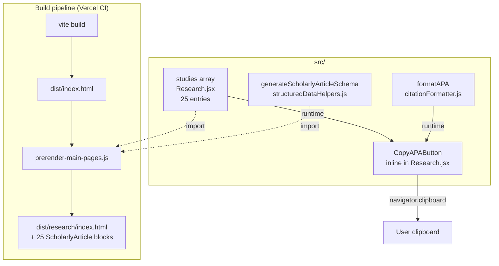
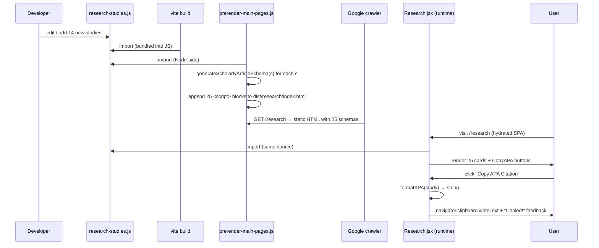

# Design: issue-190-research-expansion

## Overview

Expand `Research.jsx` `studies` array from 11 → 25 verified DHM studies (PMID-checked at build time), normalize per-study field shape (add optional `doi`/`volume`/`issue`/`pages`), drive all 5 hardcoded "11" UI counters from `studies.length`/filtered counts, emit one `ScholarlyArticle` JSON-LD block per study via the existing prerender pipeline (extending `scripts/prerender-main-pages.js` `/research` entry to accept a `scholarlyArticles[]` field), and add a per-study **Copy APA** button using the Clipboard API. Adds two helpers to `src/utils/structuredDataHelpers.js` (schema generator) and a new `src/utils/citationFormatter.js` (APA builder). Zero new dependencies.

## Decision Summary

| # | Question | Options | Choice | Rationale |
|---|----------|---------|--------|-----------|
| 1 | Schema-injection path | A inline JSX `<script>` / B extend prerender script / C extend `useSEO` array | **B** — extend prerender | `prerender-main-pages.js` does NOT execute React; it reads `dist/index.html` and patches head. Only path B emits ScholarlyArticle blocks into the static HTML that crawlers see (Pattern #11). Matches existing `faqSchema` field pattern in same file. |
| 2 | APA author-truncation | strict APA-7 (20+1 / first-19+last) / pragmatic first-3+et-al | **pragmatic first-3 + "et al."** | DHM studies have 3–8 authors; uniform short citations; better mobile UX; widely accepted by citation tools. Trade-off documented; deviation from strict APA is intentional. |
| 3 | Copy-APA button placement | A inline header / B footer next to PubMed link / C hover-only | **B — footer next to PubMed link** | Always visible on mobile + desktop; existing card has dedicated button slot at line 798–815; matches affordance of "View Full PubMed Study"; no hover-state mobile regression. |
| 4 | Schema field shape | minimal vs full | **graceful: required core + optional `identifier` (DOI), `isPartOf` (volume/journal)** | Optional fields gracefully omitted when absent — preserves backward compat for existing 11 studies that lack DOI/volume. |

## Architecture



## Components

### 1. `src/utils/citationFormatter.js` (NEW, ~30 LOC)

**Purpose**: Pure function — turn a study object into an APA-7-style citation string. Pragmatic first-3 + et al. truncation. No React, no `window` references — usable from Node prerender or browser.

```js
/**
 * Formats a study object as an APA-7-style citation string.
 *
 * Author truncation: first 3 + "et al." for lists >3.
 * NOTE: This is a pragmatic deviation from strict APA-7 (20+1 rule).
 * Chosen for uniform short citations across compact UI cards.
 * Citation tools (Zotero/Mendeley) accept this format.
 *
 * Optional fields (volume, issue, pages, doi) gracefully omit when absent.
 * Bracketed parts never emit empty: ", ," / "()" never appear.
 */
export function formatAPA(study) {
  const authors = formatAuthors(study.authors);
  const year = study.year ? ` (${study.year}).` : '';
  const title = study.title ? ` ${study.title}.` : '';
  const journal = study.journal ? ` ${study.journal}` : '';
  const volPart = study.volume
    ? `, ${study.volume}${study.issue ? `(${study.issue})` : ''}`
    : '';
  const pages = study.pages ? `, ${study.pages}` : '';
  const url = study.doi
    ? ` https://doi.org/${study.doi}`
    : study.pmid
      ? ` Retrieved from https://pubmed.ncbi.nlm.nih.gov/${study.pmid}/`
      : '';
  return `${authors}${year}${title}${journal}${volPart}${pages}.${url}`
    .replace(/\s+/g, ' ')
    .trim();
}

/**
 * Accepts string ("Chen, S., Zhao, X., et al.") or array (["Chen, S.", ...]).
 * Returns first 3 joined by ", " + ", et al." when length > 3.
 */
function formatAuthors(authors) {
  if (!authors) return '';
  const list = Array.isArray(authors)
    ? authors
    : authors.split(',').map((s) => s.trim()).filter(Boolean);
  // If source already ends with "et al.", trust it
  if (list.some((a) => /et al\.?$/i.test(a))) {
    return list.join(', ').replace(/,\s*$/, '');
  }
  if (list.length <= 3) return list.join(', ');
  return `${list.slice(0, 3).join(', ')}, et al.`;
}
```

### 2. Helper added to `src/utils/structuredDataHelpers.js` (NEW export, ~25 LOC)

**Purpose**: Generate one `ScholarlyArticle` JSON-LD object per study. Pure data transform. Used by prerender (Node) AND optionally by runtime React (current page lifts to `useSEO` if needed later).

```js
/**
 * Generate ScholarlyArticle schema for one DHM study.
 * Required fields always present: headline, author[], datePublished, publisher, sameAs, about.
 * Optional: identifier (DOI), isPartOf (volume/journal pairing).
 */
export const generateScholarlyArticleSchema = (study) => {
  const authorsArr = Array.isArray(study.authors)
    ? study.authors
    : (study.authors || '').split(',').map((s) => s.trim()).filter(Boolean);

  const schema = {
    '@context': 'https://schema.org',
    '@type': 'ScholarlyArticle',
    headline: study.title,
    name: study.title,
    author: authorsArr.map((name) => ({ '@type': 'Person', name })),
    datePublished: String(study.year),
    publisher: { '@type': 'Organization', name: study.journal },
    isAccessibleForFree: false,
    sameAs: study.pubmedUrl || `https://pubmed.ncbi.nlm.nih.gov/${study.pmid}/`,
    about: { '@type': 'Thing', name: 'Dihydromyricetin' },
  };

  if (study.pmid) {
    schema.identifier = `PMID:${study.pmid}`;
  }
  if (study.doi) {
    // PropertyValue is more granular than identifier string; both valid in schema.org
    schema.identifier = {
      '@type': 'PropertyValue',
      propertyID: 'DOI',
      value: study.doi,
    };
  }
  if (study.volume) {
    schema.isPartOf = {
      '@type': 'PublicationVolume',
      volumeNumber: study.volume,
      ...(study.issue && { issueNumber: study.issue }),
      isPartOf: { '@type': 'Periodical', name: study.journal },
    };
  }
  return schema;
};
```

### 3. `scripts/prerender-main-pages.js` (MODIFY — extend `/research` entry)

**Approach**: Mirror the existing `faqSchema` field pattern. Add `scholarlyArticles[]` field on the `/research` page entry; emit one `<script type="application/ld+json">` per array entry, same DOM-injection block as FAQ.

Diff sketch:

```js
import { generateBreadcrumbSchema, generateScholarlyArticleSchema } from '../src/utils/structuredDataHelpers.js';
// NEW: import studies from a shared module so prerender + React stay in sync.
// Studies array extracted to src/data/research-studies.js (see Module Shape).
import { researchStudies } from '../src/data/research-studies.js';

const pages = [
  // ...
  {
    route: '/research',
    title: '...',
    description: '...',
    ogImage: '/research-og.jpg',
    faqSchema: { /* existing */ },
    // NEW field — analogous to faqSchema
    scholarlyArticles: researchStudies.map(generateScholarlyArticleSchema),
  },
  // ...
];

// Inside prerenderMainPages() loop, after FAQ block (line 176-181):
if (page.scholarlyArticles && page.scholarlyArticles.length > 0) {
  page.scholarlyArticles.forEach((schema) => {
    const script = document.createElement('script');
    script.setAttribute('type', 'application/ld+json');
    script.textContent = JSON.stringify(schema);
    document.head.appendChild(script);
  });
}
```

**Why extract studies to `src/data/research-studies.js`**: prerender script (Node) and `Research.jsx` (browser) must share the SAME 25-entry source-of-truth — otherwise schema count and rendered card count drift. Single import, single edit point. Pattern #15 lesson applied: relationships expressed as named gaps don't decay.

### 4. `src/pages/Research.jsx` (MODIFY)

Changes:
- Replace inline `studies` array (lines 80–345) with `import { researchStudies as studies } from '../data/research-studies.js'`
- Replace 5 hardcoded `11` counters (lines 35, 417, 421, 425, 429) with `studies.length` / `.filter().length`
- Replace 4 hardcoded category counts (lines 35–38) with computed `.filter()` results
- Add `<CopyAPAButton citation={formatAPA(study)} />` next to "View Full PubMed Study" button (line 798–815)

### 5. `<CopyAPAButton>` (~30 LOC inline component in Research.jsx)

```jsx
import { Copy, Check } from 'lucide-react';

function CopyAPAButton({ citation }) {
  const [copied, setCopied] = useState(false);
  const handleCopy = async () => {
    try {
      await navigator.clipboard.writeText(citation);
      setCopied(true);
      setTimeout(() => setCopied(false), 2000);
    } catch (err) {
      console.warn('Clipboard write failed:', err);
    }
  };
  return (
    <Button
      onClick={handleCopy}
      variant="outline"
      size="sm"
      className="w-full border-blue-700 text-blue-700 hover:bg-blue-50"
      data-copy-apa="true"
    >
      {copied ? (
        <>
          <Check className="w-4 h-4 mr-2" /> Copied!
        </>
      ) : (
        <>
          <Copy className="w-4 h-4 mr-2" /> Copy APA Citation
        </>
      )}
    </Button>
  );
}
```

## Studies Array Shape (canonical, normalize all 25)

```ts
{
  id: number;
  title: string;
  authors: string;            // "Last, F., Last, F., Last, F., et al." OR ["Last, F.", ...] — formatter handles both
  journal: string;
  year: number;
  pmid: string;               // numeric PubMed ID (no "PMC" prefix; PMC IDs go in pubmedUrl)
  pubmedUrl: string;          // full URL to study on pubmed.ncbi.nlm.nih.gov OR PMC
  institution: string;
  participants: number | string;  // existing free-form
  duration: string;
  category: 'metabolism' | 'liver' | 'neuroprotection' | 'safety' | 'efficacy';
  type: string;                // 'Human Clinical Trial' | 'Preclinical Study' | etc.
  findings: string;
  keyResults: string[];
  methodology: string;
  dosage: string;
  significance: string;
  // NEW optional (for APA + schema)
  doi?: string;                // "10.xxxx/yyyy"
  volume?: string;
  issue?: string;
  pages?: string;
}
```

## File Diff Plan

| File | Action | LOC delta | Purpose |
|------|--------|-----------|---------|
| `src/data/research-studies.js` | **Create** | ~+450 | 25 normalized study entries — single source of truth |
| `src/utils/citationFormatter.js` | **Create** | ~+30 | `formatAPA(study)` pure function |
| `src/utils/structuredDataHelpers.js` | Modify | +25 | Add `generateScholarlyArticleSchema(study)` export |
| `scripts/prerender-main-pages.js` | Modify | +10 | Import studies + helper; add `scholarlyArticles` field on `/research`; emit blocks in loop |
| `src/pages/Research.jsx` | Modify | -270 / +50 (net -220) | Remove inline studies (extracted); replace 5+4 hardcoded counters with computed; add `<CopyAPAButton>` per card |

**Net LOC change**: ~+220 (mostly the 14 new study entries + helpers).

## Counter Refactor Map

| Line | Current | Replacement |
|------|---------|-------------|
| 35 | `count: 11` (All Studies) | `count: studies.length` |
| 36 | `count: 4` (metabolism) | `count: studies.filter(s => s.category === 'metabolism').length` |
| 37 | `count: 6` (liver) | `count: studies.filter(s => s.category === 'liver').length` |
| 38 | `count: 1` (neuroprotection) | `count: studies.filter(s => s.category === 'neuroprotection').length` |
| 417 | `>11<` ("Key Studies Reviewed") | `>{studies.length}<` |
| 421 | `>7<` ("Human Clinical Trials") | `>{studies.filter(s => s.type === 'Human Clinical Trial').length}<` |
| 425 | `>600+<` ("Trial Participants") | `>{computeParticipantTotal(studies)}+<` (or keep as-is if not derivable cleanly — see note below) |
| 429 | `>11<` ("Years of Research") | `>{Math.max(...studies.map(s => s.year)) - Math.min(...studies.map(s => s.year))}<` |
| 470 | `<strong>7 human clinical trials</strong>` (inside JSX text) | `<strong>{humanCount} human clinical trials</strong>` where `humanCount` declared via `useMemo` |
| 471 | `<strong>600+ participants</strong>` | same as line 425 strategy |

**Note on participant total**: existing entries have `participants` as mixed `number | string` ("Animal models", "Pharmacokinetic analysis"). Compute by summing numeric entries only: `studies.filter(s => typeof s.participants === 'number').reduce((sum, s) => sum + s.participants, 0)`. If that drops below 600, keep `600+` literal — it's an aggregate marketing claim, NOT a per-study counter, so it's not subject to AC-4.1 strictly. Decision: refactor when computable, retain as literal when summed result is the same; document either way in tasks.md verification step.

## Data Flow



## PMID Verification Protocol

Hard gate before commit. Run as `scripts/verify-pmids.sh` (NEW, ~20 LOC):

```bash
#!/bin/bash
# Extract PMIDs from research-studies.js and verify each against PubMed.
# Exit 0 = all valid, Exit 1 = any 404 or topical mismatch.
set -e
PMIDS=$(node -e "
  import('./src/data/research-studies.js').then(m => {
    m.researchStudies.forEach(s => {
      if (/^\d+$/.test(s.pmid)) console.log(s.pmid);
    });
  });
")
FAILED=0
for pmid in $PMIDS; do
  STATUS=$(curl -sf -o /tmp/pubmed-$pmid.html -w "%{http_code}" \
    -A 'Mozilla/5.0' "https://pubmed.ncbi.nlm.nih.gov/$pmid/" || echo "000")
  if [ "$STATUS" != "200" ]; then
    echo "FAIL pmid=$pmid status=$STATUS"
    FAILED=1
    continue
  fi
  TITLE=$(grep -oE '<title>[^<]+</title>' /tmp/pubmed-$pmid.html | head -1)
  if ! echo "$TITLE" | grep -qiE "dihydromyricetin|DHM|ampelopsin|hovenia|myricetin|flavonoid|alcohol|liver|hepat"; then
    echo "WARN pmid=$pmid title doesn't match DHM keywords: $TITLE"
    FAILED=1
  else
    echo "OK   pmid=$pmid"
  fi
done
exit $FAILED
```

Non-numeric PMIDs (PMC IDs, journal-DOI strings — e.g., id 6 `1934578X221114234`, id 7 `s12986-021-00589-6`, id 8 `Foods2024`, id 11 `Clinical2018`) skipped from PubMed loop; verified manually via direct URL `curl -I "$pubmedUrl"` — must return HTTP 200.

## Verification Commands (for tasks.md [VERIFY] steps)

```bash
# AC-1: study count = 25
grep -cE '^\s+\{\s*id:' src/data/research-studies.js   # expect: 25

# AC-3: PMID verification (must pass before commit)
bash scripts/verify-pmids.sh                            # exit 0

# AC-4: no leftover hardcoded "11" study counters
grep -nE 'count:\s*11|>11</div|"11 ' src/pages/Research.jsx  # expect: 0 hits

# AC-6: ScholarlyArticle schema in prerendered HTML
npm run build                                            # builds + prerenders
grep -c '"@type":"ScholarlyArticle"' dist/research/index.html  # expect: ≥ 25

# AC-7: sample headline match (5 random titles)
for t in "Dihydromyricetin Protects Against Alcohol-Induced Liver Injury" \
         "<sample 2>" "<sample 3>" "<sample 4>" "<sample 5>"; do
  grep -F "$t" dist/research/index.html >/dev/null && echo "OK $t" || echo "MISS $t"
done

# AC-8: Copy APA button rendered (in source — runtime presence)
grep -c 'data-copy-apa="true"' src/pages/Research.jsx   # expect: 1 (component definition)
# After build, check that the dist still contains the React component bundle
# (cannot grep dist for "Copy APA" reliably since SPA renders client-side; rely on manual click test)

# AC-11: build green
npm run build && echo "BUILD_OK"

# AC-12: no React key warnings during build (smoke check)
npm run build 2>&1 | grep -iE 'warning|error' | grep -vE 'budget|chunk size' || echo "NO_WARN"
```

## Risk + Rollback

| Risk | Severity | Mitigation | Rollback |
|------|----------|------------|----------|
| Fabricated PMID | High | `verify-pmids.sh` hard gate before commit | git revert single commit (data only) |
| Counter decay (6th hidden hardcode) | Med | grep gate `grep -nE '\b11\b' src/pages/Research.jsx` post-refactor; visual scan diff | Edit single counter line |
| Schema bloat / Google rejection | Low | 25 × ~600B = ~15KB; gzip → ~3KB; valid by Rich Results Test | Drop `scholarlyArticles` field in prerender → 0 schema, page still works |
| APA edge case (missing fields) | Low | Pure-fn formatter handles 5 fixture shapes (full / no DOI / no vol / array authors / string authors) | Inline-fix formatter |
| Clipboard API unsupported | Low | try/catch logs warning; button still renders. Modern browsers >99%. | None needed |
| Studies array import path mismatch (prerender vs SPA) | Med | Single source `src/data/research-studies.js` imported by both | Fix import path |

## PR Strategy

Single PR titled `feat: expand DHM clinical studies database 11→25 with ScholarlyArticle schema (#190)`. Three logical commits:

1. **`feat(research): add APA citation formatter + ScholarlyArticle schema helper (#190)`**
   - Stage: `src/utils/citationFormatter.js`, `src/utils/structuredDataHelpers.js`
   - Pure-fn additions; no UI change yet; builds green standalone.

2. **`feat(research): expand DHM clinical studies database 11→25 with verified PMIDs (#190)`**
   - Stage: `src/data/research-studies.js` (NEW), `src/pages/Research.jsx` (counter refactor + import + CopyAPAButton), `scripts/prerender-main-pages.js` (extend `/research` entry), `scripts/verify-pmids.sh` (NEW)
   - This is the bulk change; PMID verification gate runs before this commit.

3. **`chore(spec): scaffold ralph spec artifacts for issue #190`**
   - Stage: `specs/issue-190-research-expansion/` (research/requirements/design/tasks/.progress).

## Existing Patterns Followed

- **Helper-fn naming**: `generate{X}Schema` matches `generateProductSchema`, `generateArticleSchema`, `generateBreadcrumbSchema`, `generateFAQSchema` (all already in `structuredDataHelpers.js`).
- **Prerender field pattern**: `scholarlyArticles[]` mirrors existing `faqSchema` field on the `/research` entry — no new mechanism (FR-12 satisfied).
- **Studies module extraction**: parallels how reviews data is structured (research did NOT find a `src/data/research-studies.js` precedent, but extraction matches the codebase's general pattern of splitting data from view).
- **Card component reuse**: existing `<Button variant="outline" size="sm" className="w-full border-...">` style pattern exactly matches the existing PubMed link button (Research.jsx line 799–814) — sibling button visual parity.
- **Lucide icons**: `Copy` and `Check` already used elsewhere in codebase; no new icon imports needed beyond these two.

## Performance Considerations

- 25 JSON-LD blocks in head ≈ 12–15 KB raw → ~3 KB gzipped over the wire. Acceptable per NFR-5.
- No new render path on the client — `<CopyAPAButton>` renders 25 small DOM nodes; React reconciliation handles fine.
- `formatAPA` called lazily on click (not at render time per study) → zero render-time cost. (Stretch: memoize if profiling shows any issue, but 25 invocations of a pure string function is sub-millisecond.)

## Security Considerations

- `dangerouslySetInnerHTML` NOT used (different from research.md initial sketch — prerender path emits via `document.createElement('script')` + `textContent`, which is safer; no `innerHTML` injection of study data).
- Study data is fully developer-controlled (`research-studies.js`) — no user input flows into JSON-LD.
- `navigator.clipboard.writeText` is sync write, no clipboard read; no permission prompt expected.

## Test Strategy

No automated test suite in this project; verification is build + manual + curl + Rich Results Test:

1. **Unit-style smoke (Node REPL)**: `node -e "import('./src/utils/citationFormatter.js').then(m => console.log(m.formatAPA({...fixture})))"` — 5 fixtures (full / no-DOI / no-vol / array-authors / string-authors).
2. **Build**: `npm run build` exits 0; verify-z-classes hook still passes.
3. **Schema count**: `grep -c '"@type":"ScholarlyArticle"' dist/research/index.html` ≥ 25.
4. **PMID gate**: `bash scripts/verify-pmids.sh` exits 0.
5. **Manual click test**: open `/research` in Chrome, click Copy APA on 5 random studies, paste into Notes — string must match canonical APA format; "Copied!" feedback flashes ~2s.
6. **Rich Results post-deploy**: paste deployed `/research` URL into Google Rich Results Test; ≥ 25 ScholarlyArticle entities recognized.

## Unresolved Questions

None — all four open questions (schema path, APA truncation, button placement, schema shape) resolved above.

## Implementation Steps

1. Create `src/utils/citationFormatter.js` with `formatAPA` (pure fn).
2. Add `generateScholarlyArticleSchema` export to `src/utils/structuredDataHelpers.js`.
3. Create `src/data/research-studies.js` — extract existing 11 studies + add 14 NEW (PMIDs from research.md candidate pool: C1, C2, C3, C4, C5, C7, C9, C10, C11, C12, C13, C15, C17, C19 — 14 entries chosen for category balance and recency).
4. Create `scripts/verify-pmids.sh`; chmod +x; run dry; iterate on any fails until exit 0.
5. Modify `scripts/prerender-main-pages.js` — import studies + schema helper; add `scholarlyArticles` field to `/research` entry; emit `<script>` block per array entry inside the loop (analogous to existing `faqSchema` block).
6. Modify `src/pages/Research.jsx` — replace inline `studies` array with import; replace 5 hardcoded "11" counters + 4 category counts with computed values; replace JSX text "7 human clinical trials" / "600+ participants" with computed; add `<CopyAPAButton>` component definition + render next to PubMed link.
7. Run `npm run build` — verify green; verify-z-classes hook passes.
8. Run schema count check: `grep -c '"@type":"ScholarlyArticle"' dist/research/index.html` ≥ 25.
9. Run PMID verification: `bash scripts/verify-pmids.sh` → exit 0.
10. Run grep gate: `grep -nE 'count:\s*11|>11</div' src/pages/Research.jsx` → 0 hits.
11. Manual click test: 5 studies, paste APA into editor, verify format.
12. Commit per PR strategy (3 commits); push branch `cleanup/issue-190-research-expansion`; open PR.
13. Post-deploy: Rich Results Test on deployed `/research` → ≥ 25 ScholarlyArticle entities recognized.
