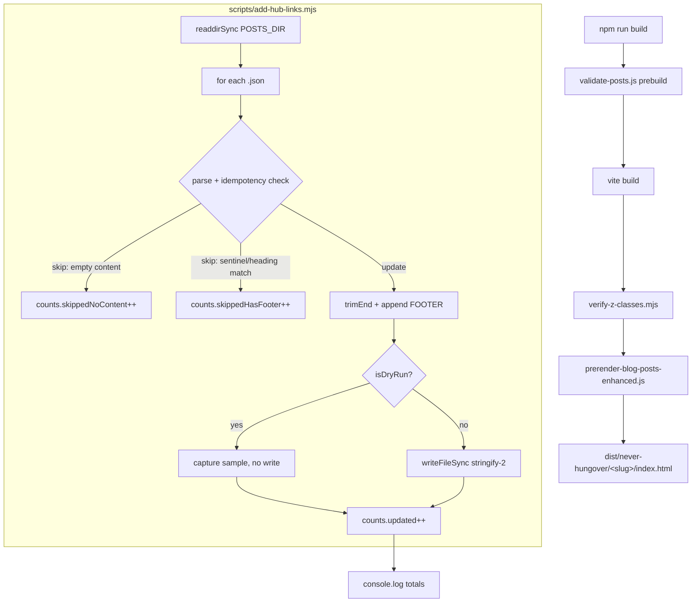

# Design: issue-246-hub-footer

## Overview

Single ESM script `scripts/add-hub-links.mjs` (~80 lines, no deps beyond stdlib) reads 197 post JSONs from `src/newblog/data/posts/`, applies two-layer idempotency (sentinel comment OR heading substring), appends a verbatim 4-link "Continue Your Research" footer to `post.content`, and writes back via `JSON.stringify(obj, null, 2)` with NO trailing newline (matches existing 197 files). Default mode is live; `--dry-run` flag prints first 3 sample diffs + counts and writes nothing. Footer reaches crawlers automatically because `prerender-blog-posts-enhanced.js:311` micromarks `post.content` into `dist/never-hungover/<slug>/index.html` (Pattern #11 verified). Script header docstring points maintainers to `specs/issue-246-hub-footer/`.

## Architecture



## Module Shape

```js
#!/usr/bin/env node
/**
 * add-hub-links.mjs
 * Appends "Continue Your Research" footer to every blog post's content field.
 * Idempotent: skips on sentinel comment OR heading substring match.
 *
 * Usage:
 *   node scripts/add-hub-links.mjs              # live run (default)
 *   node scripts/add-hub-links.mjs --dry-run    # print diff for first 3 + counts; write nothing
 *
 * Spec: specs/issue-246-hub-footer/
 */

import { readdirSync, readFileSync, writeFileSync } from 'node:fs';
import { join } from 'node:path';

const POSTS_DIR = 'src/newblog/data/posts';
const SENTINEL = '<!-- hub-footer:auto -->';
const HEADING = '## Continue Your Research';

const FOOTER = `

---

${SENTINEL}
${HEADING}

- **[Complete DHM Guide →](/guide)** - Dosage, timing, and how DHM works
- **[Compare Supplements →](/compare)** - Side-by-side product comparison
- **[Product Reviews →](/reviews)** - In-depth reviews of 7 tested supplements
- **[Clinical Research →](/research)** - 11 peer-reviewed DHM studies
`;

const isDryRun = process.argv.includes('--dry-run');

const files = readdirSync(POSTS_DIR).filter(f => f.endsWith('.json'));
const counts = { updated: 0, skippedHasFooter: 0, skippedNoContent: 0, samples: [] };

for (const file of files) {
  const filePath = join(POSTS_DIR, file);
  const raw = readFileSync(filePath, 'utf8');
  const post = JSON.parse(raw);

  if (typeof post.content !== 'string' || post.content.length === 0) {
    counts.skippedNoContent++;
    continue;
  }

  if (post.content.includes(SENTINEL) || post.content.includes(HEADING)) {
    counts.skippedHasFooter++;
    continue;
  }

  post.content = post.content.trimEnd() + FOOTER;

  if (isDryRun) {
    if (counts.samples.length < 3) {
      counts.samples.push({ file, beforeTail: raw.slice(-150) });
    }
  } else {
    // No trailing newline (matches existing 197 files; minimizes diff churn)
    writeFileSync(filePath, JSON.stringify(post, null, 2));
  }
  counts.updated++;
}

console.log(`${isDryRun ? '[dry-run] ' : ''}Done: ${counts.updated} updated, ${counts.skippedHasFooter} skipped (had footer), ${counts.skippedNoContent} skipped (no content)`);

if (isDryRun && counts.samples.length) {
  console.log('\nFirst 3 sample diffs (tail of original content):');
  for (const s of counts.samples) {
    console.log(`\n  ${s.file}:`);
    console.log(`    before tail: ...${s.beforeTail.slice(-80).replace(/\n/g, '\\n')}`);
    console.log(`    after: ...trimEnd() + FOOTER block (${FOOTER.length} chars)`);
  }
}

process.exit(0);
```

Estimated final line count: ~80 lines including license/doc header.

## Components

### `add-hub-links.mjs`
**Handles:**
- Read corpus from `src/newblog/data/posts/*.json`
- Idempotency check (two-layer: sentinel + heading)
- Append-only mutation (preserves all other JSON fields)
- Dry-run mode for diff preview
- Tally and report counts

**Inputs:** `--dry-run` flag (optional)
**Outputs:** Mutated JSON files (live mode) OR sample diffs (dry-run); console summary

## Idempotency Rules (Ordered)

| Order | Check | Action | Counter |
|-------|-------|--------|---------|
| 1 | `typeof post.content !== 'string'` OR `length === 0` | Skip | `skippedNoContent` |
| 2 | `post.content.includes(SENTINEL)` | Skip | `skippedHasFooter` |
| 3 | `post.content.includes(HEADING)` | Skip | `skippedHasFooter` |
| 4 | None of above | Append | `updated` |

**Rationale:**
- Sentinel `<!-- hub-footer:auto -->` catches script-managed footers (re-runs)
- Heading `## Continue Your Research` catches manual additions/curated cases
- Empty/missing content guards against corrupt corpus entries (research only sampled 5 posts; defensive)
- Order matters: empty-content check first (cheapest); sentinel before heading (sentinel is more specific)

## Footer Template (Verbatim)

The exact string appended after `post.content.trimEnd()`:

```
\n\n---\n\n<!-- hub-footer:auto -->\n## Continue Your Research\n\n- **[Complete DHM Guide →](/guide)** - Dosage, timing, and how DHM works\n- **[Compare Supplements →](/compare)** - Side-by-side product comparison\n- **[Product Reviews →](/reviews)** - In-depth reviews of 7 tested supplements\n- **[Clinical Research →](/research)** - 11 peer-reviewed DHM studies\n
```

In source (template literal), this renders as:

```
\n
\n
---
\n
\n
<!-- hub-footer:auto -->\n
## Continue Your Research\n
\n
- **[Complete DHM Guide →](/guide)** - Dosage, timing, and how DHM works\n
- **[Compare Supplements →](/compare)** - Side-by-side product comparison\n
- **[Product Reviews →](/reviews)** - In-depth reviews of 7 tested supplements\n
- **[Clinical Research →](/research)** - 11 peer-reviewed DHM studies\n
```

Anchor text and `→` arrows match issue #246 verbatim. No emoji. Sentinel placed AFTER `---` so the visible footer in rendered HTML starts cleanly with the horizontal rule.

## Technical Decisions

| Decision | Options | Choice | Rationale |
|----------|---------|--------|-----------|
| Default mode | dry-run vs live | **Live** (per task delegation skeleton) | User explicitly requested `--dry-run` as opt-in flag in delegation; matches simpler precedent |
| Idempotency | heading-only vs sentinel-only vs both | **Both** | Belt-and-suspenders; near-zero cost; covers manual + script-managed cases |
| Trailing file newline | yes vs no | **No** | All 197 existing files lack one; minimizes git diff churn |
| Indent | 2 vs 4 spaces | **2** | Matches existing files (`JSON.stringify(obj, null, 2)`) |
| Sentinel placement | before vs after `---` | **After `---`, immediately above heading** | Cleaner visual: rendered HTML shows `<hr>` then heading; sentinel hidden by micromark |
| Idempotency check ordering | content-empty first vs last | **First** | Cheapest; guards corrupt entries before string ops |

## File Structure

| File | Action | Purpose |
|------|--------|---------|
| `scripts/add-hub-links.mjs` | Create | The script |
| `src/newblog/data/posts/*.json` | Modify (197) | Append footer to `content` field |

## Error Handling

| Scenario | Handling | User Impact |
|----------|----------|-------------|
| `JSON.parse` throws on malformed JSON | Uncaught throw → script exits non-zero | Stops; user inspects which file failed (printed in stack trace); no partial corpus updates because failure happens during read, before write |
| Post `content` field missing/null | Skip with `skippedNoContent++` | Counter reported; no write |
| `writeFileSync` fails (perm/disk) | Uncaught throw → script exits non-zero | Partial run; idempotency means re-run skips already-written files and resumes |
| `post.content.includes(SENTINEL)` already true | Skip with `skippedHasFooter++` | Idempotent re-runs report 0 updated, all skipped |

**Deliberate non-handling:** No try/catch wrapping JSON.parse. If a JSON file is malformed, fail-fast is correct — `validate-posts.js` would catch it on next build anyway.

## Edge Cases

- **Empty content field**: skipped with `skippedNoContent` counter (defensive — research sampled 5 posts; 197 untested for this case)
- **Content ends with multiple trailing newlines**: `.trimEnd()` removes them all; `\n\n---` provides exactly one blank line + separator
- **Post already has heading "Continue Your Research" anywhere in body** (curated edit, future hand-written footer): skipped (conservative; better to skip 1-2 false positives than double-inject)
- **Re-run after partial completion** (e.g., interrupted by Ctrl-C): already-written posts have sentinel → skipped; remaining posts get appended
- **New post added later**: run script once; appears in `files` array; appended

## Test Strategy

### Manual Verification (no unit tests added)
The script's behavior is verified by the [VERIFY] commands in tasks.md. No new test files. Reasons:
- Script is single-use idiom (mirrors `cluster-formalize.mjs`, `orphan-post-link-injector.mjs` — neither has unit tests)
- `validate-posts.js` prebuild check is the structural safety net for JSON integrity
- Re-run idempotency is the strongest functional test (AC-3)

### Verification Commands

```bash
# AC-2 dry-run
node scripts/add-hub-links.mjs --dry-run
# expect: "[dry-run] Done: 197 updated, 0 skipped (had footer), 0 skipped (no content)"
# expect: 3 sample diff lines

# AC-4 live run
node scripts/add-hub-links.mjs
# expect: "Done: 197 updated, 0 skipped (had footer), 0 skipped (no content)"

# AC-3 idempotency proof
node scripts/add-hub-links.mjs   # second run; should report 0 updated, 197 skipped (had footer)

# AC-4 corpus update
grep -l "Continue Your Research" src/newblog/data/posts/*.json | wc -l   # should be 197

# AC-5 prerender propagation
npm run build
for slug in dhm-dosage-guide-2025 hangxiety-complete-guide-2026-supplements-research dhm-vs-zbiotics flyby-recovery-review-2025 hangover-supplements-complete-guide-what-actually-works-2025; do
  grep -c "Continue Your Research" "dist/never-hungover/$slug/index.html"
done   # each should print >= 1

# AC-6 hub link presence in built HTML
for slug in dhm-dosage-guide-2025 dhm-vs-zbiotics; do
  grep -oE 'href="/(guide|compare|reviews|research)"' "dist/never-hungover/$slug/index.html" | sort -u | wc -l
done   # each should print 4

# AC-8 build green
echo $?   # 0

# NFR-3 no trailing newline (sample 5 files)
for f in src/newblog/data/posts/dhm-dosage-guide-2025.json src/newblog/data/posts/dhm-vs-zbiotics.json src/newblog/data/posts/flyby-recovery-review-2025.json src/newblog/data/posts/hangxiety-complete-guide-2026-supplements-research.json src/newblog/data/posts/hangover-supplements-complete-guide-what-actually-works-2025.json; do
  tail -c 1 "$f" | xxd | grep -q '7d ' && echo "$f: OK (ends with })" || echo "$f: FAIL (does not end with })"
done

# NFR-1 deps unchanged
git diff package.json   # should show no changes to dependencies/devDependencies
```

8 verification command groups (AC-2, AC-3, AC-4, AC-5, AC-6, AC-8, NFR-3, NFR-1).

## Performance Considerations

- 197 files × ~50KB avg = ~10MB total read; ~50ms total runtime expected on M-series Mac
- Synchronous I/O is fine at this scale; no async/parallel needed
- `JSON.stringify` on each parsed object: O(n) per file, negligible
- No string allocation for `--dry-run` mode beyond the 3 sample tails (150 chars each)

## Security Considerations

- Script reads/writes only files under `src/newblog/data/posts/*.json` (no path traversal — `readdirSync` returns flat names; `join` constrains to dir)
- No network calls
- No shell exec
- No eval / no dynamic require

## Existing Patterns to Follow

| Pattern | Source | Application |
|---------|--------|-------------|
| ESM script in `scripts/` with `node:` import prefix | `cluster-formalize.mjs`, `orphan-post-link-injector.mjs` | Use `import { ... } from 'node:fs'` |
| Sentinel HTML comment for auto-managed sections | `<!-- cluster-pillar-link:auto -->`, `<!-- cluster-index:auto -->` | Use `<!-- hub-footer:auto -->` |
| `JSON.parse` → mutate object → `JSON.stringify(obj, null, 2)` | All backfill scripts | Apply identically |
| Post-corpus iteration (`readdirSync` + `.filter('.json')`) | `related-posts-backfill.mjs` | Apply identically |
| `--dry-run` flag with sample diff preview | `cluster-formalize.mjs` | Apply (default = live, opt-in dry-run per delegation) |
| Pre-build JSON validation safety net | `validate-posts.js` (prebuild) | Rely on it; no manual integrity check needed in script |
| No trailing newline on JSON files | All 197 existing files | DEVIATE from cluster-formalize/orphan-injector convention; use bare `JSON.stringify` |
| Prerender pipeline ships `content` to crawlers | `prerender-blog-posts-enhanced.js:311` | No script changes needed (Pattern #11) |

## Risk Table

| Risk | Severity | Mitigation |
|------|----------|------------|
| Script writes broken JSON to all 197 posts | High | (a) Run `--dry-run` first; review 3 samples. (b) `validate-posts.js` prebuild fails-fast on parse errors. (c) Branch-as-backup: `git restore src/newblog/data/posts/` reverts in seconds. |
| Footer doesn't propagate to prerender | Med | Pattern #11 verified — `prerender-blog-posts-enhanced.js:311` renders `content` via micromark. AC-5/AC-6 verify in dist. |
| Hub URL drift (e.g., `/guide` route renamed) | Low | Hub URLs hardcoded in CLAUDE.md and verified live; no recent renames. |
| Double-injection on edge case | Low | Two-layer idempotency (sentinel + heading-substring). |
| `validate-posts.js` rejects new content | Low | `validate-posts.js` checks JSON parse + schema; appending to `content` string doesn't change schema. |
| Trailing newline divergence breaks downstream tooling | Very Low | All 197 existing files already lack trailing newline; matching them is the safe choice. |

## Rollback

```bash
git restore src/newblog/data/posts/
```

Reverts in seconds. Script's only side effect is JSON file writes to that directory. No DB, no external state, no cache invalidation needed.

## PR Strategy

Single PR off `cleanup/issue-246-hub-footer` with 3 commits:

| # | Commit | Files | Purpose |
|---|--------|-------|---------|
| 1 | `feat(scripts): add idempotent hub-link footer script (#246)` | `scripts/add-hub-links.mjs` | Script only |
| 2 | `feat(content): add Continue Your Research footer to 197 blog posts (#246)` | `src/newblog/data/posts/*.json` | JSON updates only |
| 3 | `chore(spec): scaffold ralph spec artifacts for issue #246` | `specs/issue-246-hub-footer/tasks.md` | tasks.md only (`.ralph-state.json`, `.progress.md` gitignored) |

Order: 1 (script) → 2 (data, generated by running 1) → 3 (spec). Reviewer can verify commit 2 by re-running commit 1's script and observing identical diff.

## Implementation Steps

1. Create `scripts/add-hub-links.mjs` per the Module Shape section above (~80 lines)
2. Run `node scripts/add-hub-links.mjs --dry-run` — confirm output: `[dry-run] Done: 197 updated, 0 skipped (had footer), 0 skipped (no content)` + 3 sample diffs
3. Run `node scripts/add-hub-links.mjs` — confirm output: `Done: 197 updated, 0 skipped (had footer), 0 skipped (no content)`
4. Run `node scripts/add-hub-links.mjs` again (re-run) — confirm idempotency: `Done: 0 updated, 197 skipped (had footer), 0 skipped (no content)`
5. Run `grep -l "Continue Your Research" src/newblog/data/posts/*.json | wc -l` — confirm 197
6. Run `npm run build` — confirm exit 0; `validate-posts.js` passes; prerender step writes 197 dist HTMLs
7. Run AC-5 grep loop (5 sample dist HTMLs) — confirm each prints `>= 1`
8. Run AC-6 grep loop — confirm each prints 4 (4 unique hub hrefs)
9. Run NFR-3 trailing-byte check on 5 sample post JSONs — confirm last byte is `}`
10. Run `git diff package.json` — confirm no changes to dependencies
11. Stage commits per PR Strategy table
12. Open PR; cite AC numbers in description
