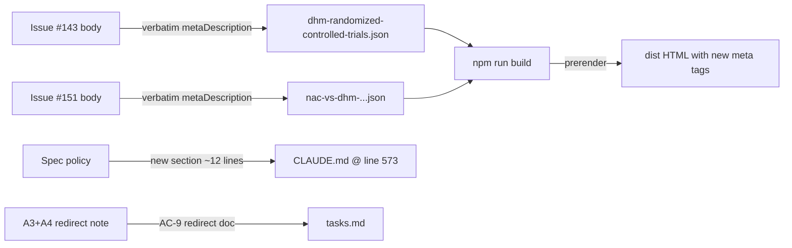

# Design: issue-345-residual

## Overview

Two file edits (A1 + A2) on post JSONs touching only the `metaDescription` field. One file edit (B1) appending a ~12-line "Spec Artifact Commit Policy" section to project `CLAUDE.md`. A3 + A4 redirected to `cleanup/issue-209-best-for-buttons` branch (target code does not exist on main) — documented in `tasks.md` per AC-9. Total diff: 2 single-field JSON edits + 1 markdown section + 1 spec note. No code logic, no dependencies, no `.gitignore` change.

## Decisions Resolved

### D1: Where to document the spec policy (B1)?

| Option | Verdict | Rationale |
|---|---|---|
| **(a) Add ~12 lines to project `CLAUDE.md`** | **CHOSEN** | CLAUDE.md auto-loads every session — maximum discoverability. Single-file change. No new file to find. |
| (b) Create `specs/.policy.md` | Rejected | Adds a file nobody would naturally open. Lower discoverability. |
| (c) Document only in this spec's research.md | Rejected | Institutional-knowledge only — invisible to future contributors. |

**Insertion location**: after `## 🔄 Continuous Improvement` (lines 559–573) and its trailing `---` divider, before `## ⚠️ Red Flags (STOP and Simplify)` (line 575). Natural fit because spec-hygiene is a workflow/process rule like Continuous Improvement, and pairing it before the "stop and simplify" rules reads coherently. Concretely: insert new `## Spec Artifact Commit Policy` section immediately after line 573.

### D2: Verbatim meta-description text (verified against issues #143 + #151)

**Issue #143** (`gh issue view 143 --jq .body`):
- File: `src/newblog/data/posts/dhm-randomized-controlled-trials.json`
- Current `metaDescription` (129 chars): `Peer-reviewed DHM clinical trials show 70% hangover reduction. UCLA and USC research explains exactly how DHM prevents hangovers.`
- New `metaDescription` (149 chars, verbatim from issue): `Breakthrough 2024 study proves DHM cuts hangover severity by 70%. See the peer-reviewed results from Foods journal that explain exactly how it works.`

**Issue #151** (`gh issue view 151 --jq .body`):
- File: `src/newblog/data/posts/nac-vs-dhm-which-antioxidant-better-liver-protection-2025.json`
- Current `metaDescription` (138 chars): `NAC vs DHM for liver protection: NAC excels for daily support ($6-15/mo), DHM works best before drinking. Compare dosing, cost, and usage.`
- New `metaDescription` (143 chars, verbatim from issue): `NAC vs DHM: Which protects your liver better? Complete comparison reveals when to use each (and why combining them may be the smartest choice).`

Both new texts under the 160-char SERP truncation threshold (149 / 143). No trimming needed.

### D3: CLAUDE.md insertion location (precise)

CLAUDE.md current section order (line numbers):
| Line | Section |
|---|---|
| 3 | 🧘 SIMPLICITY FIRST |
| 27 | 🚀 COMPLETE DEVELOPMENT WORKFLOW |
| 198 | 🛡️ SIMPLICITY ENFORCEMENT EXAMPLES |
| 221 | 📁 DHM Guide Specific Context |
| 279 | 🎯 Quick Command Reference |
| 325 | 📋 Proven Patterns from Real Work |
| 559 | 🔄 Continuous Improvement |
| **575** | ⚠️ Red Flags (insertion point — new section goes ABOVE this) |
| 590 | 📈 Success Metrics |

**Concrete edit target**: line 573 (`---` divider following Continuous Improvement). Insert new `## Spec Artifact Commit Policy` section + trailing `---` divider between line 573 and line 575.

## Architecture



## File-by-File Plan

### File 1: `src/newblog/data/posts/dhm-randomized-controlled-trials.json`

| Aspect | Detail |
|---|---|
| Action | Modify single field |
| Field | `metaDescription` |
| Old text | `"Peer-reviewed DHM clinical trials show 70% hangover reduction. UCLA and USC research explains exactly how DHM prevents hangovers."` |
| New text | `"Breakthrough 2024 study proves DHM cuts hangover severity by 70%. See the peer-reviewed results from Foods journal that explain exactly how it works."` |
| Char count | 129 → 149 |
| All other fields | UNTOUCHED — especially `title` (which is owned by the `cleanup/issue-143-clinical-trials-title` branch) |
| AC | AC-1, AC-2 |

### File 2: `src/newblog/data/posts/nac-vs-dhm-which-antioxidant-better-liver-protection-2025.json`

| Aspect | Detail |
|---|---|
| Action | Modify single field |
| Field | `metaDescription` |
| Old text | `"NAC vs DHM for liver protection: NAC excels for daily support ($6-15/mo), DHM works best before drinking. Compare dosing, cost, and usage."` |
| New text | `"NAC vs DHM: Which protects your liver better? Complete comparison reveals when to use each (and why combining them may be the smartest choice)."` |
| Char count | 138 → 143 |
| All other fields | UNTOUCHED — especially `title` (owned by `cleanup/issue-151-nac-dhm-title`) |
| AC | AC-3, AC-4 |

### File 3: `CLAUDE.md`

Insert after line 573 (the `---` divider following the "Continuous Improvement" section), before line 575 (the `## ⚠️ Red Flags` header). Final wording:

```markdown
## Spec Artifact Commit Policy

For each `specs/issue-*/` directory, commit:
- `research.md`
- `requirements.md`
- `design.md`
- `tasks.md`

Do NOT commit:
- `.progress.md` (gitignored — working notes that change frequently)
- `.ralph-state.json` (gitignored — runtime state)

This ensures spec history is reviewable in PR while runtime artifacts stay out of the diff.

---
```

Lines added: 14 (12 content lines + 1 trailing blank + 1 `---` divider). AC: AC-7, AC-8.

### File 4: `specs/issue-345-residual/tasks.md`

Document the A3+A4 redirect prominently. The PR body and tasks.md must both clearly state: "A3 (match-count badges) and A4 (regex expansion) redirected to `cleanup/issue-209-best-for-buttons` because the `bestForFilters` array does not exist on main." AC: AC-9.

## Components

### Component 1: JSON post-data edits (A1, A2)
**Purpose**: rewrite SERP meta descriptions per GSC CTR optimization recommendations
**Interfaces**:
```typescript
// post JSON shape (excerpt)
interface BlogPost {
  title: string;            // UNTOUCHED on this branch
  metaDescription: string;  // CHANGED on this branch
  // ... other fields untouched
}
```

### Component 2: Documentation policy (B1)
**Purpose**: codify spec-artifact commit convention so future contributors don't reverse-engineer it
**Interface**: plain-text section in CLAUDE.md auto-loaded by Claude Code each session

## Technical Decisions

| Decision | Options | Choice | Rationale |
|---|---|---|---|
| Where to put spec policy | (a) CLAUDE.md, (b) specs/.policy.md, (c) research.md only | **(a)** | Auto-loaded each session, single file edit, max discoverability |
| Insertion location in CLAUDE.md | After Continuous Improvement, after Proven Patterns, before Red Flags | **After Continuous Improvement (line 573)** | Process/workflow grouping; reads coherently before "stop and simplify" rules |
| Field to edit on post JSONs | `metaDescription`, `seo.description`, `excerpt` | **`metaDescription` only** | Confirmed camelCase field; title owned by other branches; surgical scope |
| A3/A4 disposition | (a) cherry-pick #209 here, (b) redirect to #209 branch | **(b) redirect** | `bestForFilters` doesn't exist on main; cherry-pick entangles branch state |
| Verbatim text source | Re-write, paraphrase, or copy verbatim from issue body | **verbatim** | Issues #143/#151 are the canonical source; verbatim eliminates drift risk |

## Verification Commands (for tasks.md `[VERIFY]` steps)

```bash
# AC-1, AC-3 — metaDescription updated and length under 160
node -e "const p=JSON.parse(require('fs').readFileSync('src/newblog/data/posts/dhm-randomized-controlled-trials.json','utf8')); console.log(p.metaDescription.length, '|', p.metaDescription)"
node -e "const p=JSON.parse(require('fs').readFileSync('src/newblog/data/posts/nac-vs-dhm-which-antioxidant-better-liver-protection-2025.json','utf8')); console.log(p.metaDescription.length, '|', p.metaDescription)"
# Expected: "149 | Breakthrough 2024 study proves DHM cuts hangover severity by 70%. See the peer-reviewed results from Foods journal that explain exactly how it works."
# Expected: "143 | NAC vs DHM: Which protects your liver better? Complete comparison reveals when to use each (and why combining them may be the smartest choice)."

# AC-2, AC-4 — title field UNTOUCHED (compare to main)
git diff main..HEAD -- src/newblog/data/posts/dhm-randomized-controlled-trials.json | grep '"title":' || echo "title unchanged on this branch ✓"
git diff main..HEAD -- src/newblog/data/posts/nac-vs-dhm-which-antioxidant-better-liver-protection-2025.json | grep '"title":' || echo "title unchanged on this branch ✓"

# AC-5 — meta description present in prerendered HTML
npm run build
grep -oE 'name="description" content="[^"]*"' dist/never-hungover/dhm-randomized-controlled-trials/index.html | head -1
grep -oE 'name="description" content="[^"]*"' dist/never-hungover/nac-vs-dhm-which-antioxidant-better-liver-protection-2025/index.html | head -1

# AC-6 — build green
echo $?  # expected: 0

# AC-7, AC-8 — CLAUDE.md policy present
grep -A 12 "## Spec Artifact Commit Policy" CLAUDE.md

# AC-9 — A3/A4 redirect note in tasks.md
grep -B1 -A3 "A3.*#209\|A4.*#209\|redirect.*209" specs/issue-345-residual/tasks.md
```

## Error Handling

| Error Scenario | Handling | User Impact |
|---|---|---|
| Malformed JSON after edit | `validate-posts.js` (in `npm run build` chain) catches before deploy | Build fails fast; rollback via `git restore <file>` |
| Wrong meta text (drift from issue) | Char-count assertion (149 / 143) confirms verbatim copy | Re-paste from issue body |
| CLAUDE.md merge conflict with another branch | Unique section header `Spec Artifact Commit Policy` minimizes collision; manual resolve if needed | None expected — no live April 2026 branches edit CLAUDE.md |
| Build error from prerender | Caught by `npm run build` exit code; AC-6 enforces zero | Investigate prerender script before merge |

## Edge Cases

- **Field name mismatch (`metaDescription` vs `seo.description`)**: confirmed in research — both target files use camelCase `metaDescription` at top level, no nested `seo` object.
- **Char count over 160**: verified — 149 and 143, both under 160 with safety margin.
- **#143/#151 branches haven't merged yet**: clean — title and metaDescription are different keys, layer cleanly via 3-way merge regardless of order.
- **`---` divider preservation in CLAUDE.md**: insertion adds new content + new `---` after; existing `---` at line 573 remains as separator from Continuous Improvement.

## Test Strategy

| Type | Coverage |
|---|---|
| Build | `npm run build` must exit 0 (validates JSON, runs prerender, emits dist HTML) |
| Output validation | `grep -oE 'name="description" content=...'` confirms new meta in prerendered HTML for both posts |
| Field-level diff | `git diff main` confirms ONLY `metaDescription` changed on each post JSON |
| Char count | Node one-liner asserts 149 / 143 |
| Policy doc | `grep -A 12 "## Spec Artifact Commit Policy" CLAUDE.md` confirms presence |

No unit tests exist for prerender/SEO content; the build chain itself is the test harness.

## Risk + Rollback

| Risk | Mitigation | Rollback |
|---|---|---|
| JSON corruption breaks build | `validate-posts.js` prebuild gate catches malformed JSON | `git restore src/newblog/data/posts/<file>.json` |
| Wrong meta text shipped | Verbatim copy from issue body + char-count assertion | `git restore <file>.json` |
| CLAUDE.md merge conflict | Unique section header minimizes collision; April 2026 audit confirms no other live branches edit CLAUDE.md | Manual conflict resolution; section is self-contained ~14 lines |
| A3/A4 forgotten on #209 branch | AC-9 enforces explicit redirect note in tasks.md and PR body | Open follow-up issue if redirect dropped |

## PR Strategy — Single PR with 4 Atomic Commits

Each commit is scoped to a single concern, single file (or single artifact group). Commits are ordered for clean review.

| # | Commit message | Files staged |
|---|---|---|
| 1 | `fix(seo): rewrite #143 meta description per issue acceptance criteria` | `src/newblog/data/posts/dhm-randomized-controlled-trials.json` only |
| 2 | `fix(seo): rewrite #151 meta description per issue acceptance criteria` | `src/newblog/data/posts/nac-vs-dhm-which-antioxidant-better-liver-protection-2025.json` only |
| 3 | `docs(claude): document spec artifact commit policy (#345 B1)` | `CLAUDE.md` only |
| 4 | `chore(spec): scaffold ralph spec artifacts for issue #345` | `specs/issue-345-residual/{research,requirements,design,tasks}.md` (all 4 — practicing the new policy) |

PR body must explicitly note A3+A4 redirect to `cleanup/issue-209-best-for-buttons` per AC-9.

## Existing Patterns to Follow

- **Pure data edits over code edits** (Pattern #6 in CLAUDE.md): both A1 and A2 are single-field JSON edits, lowest-risk class of change.
- **Verbatim source quoting** (research phase rule): copy from issue bodies char-for-char to eliminate drift.
- **Single source of truth for SEO** (Pattern #11): post JSONs are the canonical source; prerender + client-side both read from same JSON, no dual-source bug.
- **Atomic single-purpose commits** (project git style): one concern per commit, easy review and rollback.
- **CLAUDE.md as policy home** (existing convention): all simplicity rules, patterns, and workflow guidance already live here; spec-hygiene fits naturally.

## File Structure Summary

| File | Action | Lines | Purpose |
|---|---|---|---|
| `src/newblog/data/posts/dhm-randomized-controlled-trials.json` | Modify | 1 changed | A1: meta description rewrite |
| `src/newblog/data/posts/nac-vs-dhm-which-antioxidant-better-liver-protection-2025.json` | Modify | 1 changed | A2: meta description rewrite |
| `CLAUDE.md` | Modify | +14 inserted | B1: spec-artifact commit policy |
| `specs/issue-345-residual/research.md` | Track (already exists) | — | Spec record |
| `specs/issue-345-residual/requirements.md` | Track (already exists) | — | Spec record |
| `specs/issue-345-residual/design.md` | Create (this file) | — | Spec record |
| `specs/issue-345-residual/tasks.md` | Create (next phase) | — | Execution plan + AC-9 redirect note |

**Total LOC delta**: ~16 lines (2 JSON field edits + 14 markdown lines).

## Unresolved Questions

None. All three decision points (D1, D2, D3) resolved above. Verbatim text confirmed against live issues. CLAUDE.md insertion line identified concretely.

## Implementation Steps

1. Edit `src/newblog/data/posts/dhm-randomized-controlled-trials.json` — replace `metaDescription` value with verbatim text from issue #143
2. Edit `src/newblog/data/posts/nac-vs-dhm-which-antioxidant-better-liver-protection-2025.json` — replace `metaDescription` value with verbatim text from issue #151
3. Edit `CLAUDE.md` — insert new `## Spec Artifact Commit Policy` section after line 573 (between Continuous Improvement and Red Flags)
4. Run `npm run build` — verify exit 0, JSON valid, prerendered HTML contains new meta descriptions
5. Run AC verification commands (above) — confirm AC-1 through AC-8 pass; AC-9 deferred to tasks.md
6. Stage and commit per the 4-commit PR strategy (one file/concern per commit)
7. Open PR referencing issues #143, #151, #251, #345; PR body must call out A3+A4 redirect to `cleanup/issue-209-best-for-buttons`
