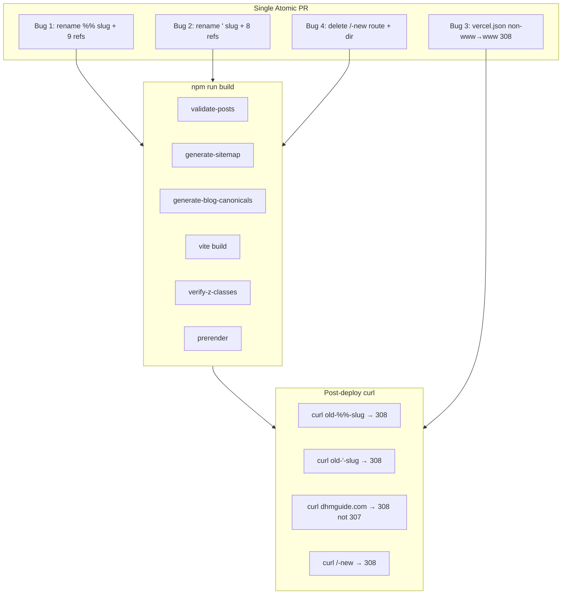
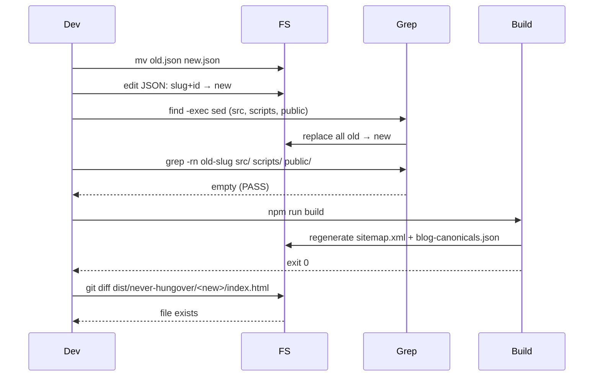

# Design: issue-363-dcni-bugs

## Overview

Four unrelated indexing bugs ship as ONE atomic PR (`cleanup/issue-363-dcni-bugs`). Total file impact ~17 (rename 2 JSONs, 4 vercel.json redirects, 2 src edits, 1 dir delete, ~13 reference updates) — well under #366 moratorium 20-file threshold. No new code paths; all changes are mechanical (rename, regex-replace, JSON-append, file-delete). Each bug is independently revertible via `git revert`.

## Architecture



## Components

### Bug 1: `%` slug rename

**Old**: `gen-z-mental-health-revolution-why-58%-are-drinking-less-for-wellness-in-2025`
**New**: `gen-z-mental-health-revolution-58-percent-drinking-less-2025`

Files (9):

| # | File | Action |
|---|------|--------|
| 1 | `src/newblog/data/posts/<old>.json` | rename + edit `slug`+`id` fields |
| 2 | `src/newblog/data/postRegistry.js:117` | regex-replace |
| 3 | `src/newblog/data/metadata/index.json:252` | regex-replace |
| 4 | `src/newblog/data/metadata/index.backup.json:252` | regex-replace |
| 5 | `scripts/cluster-config.json:170` | regex-replace |
| 6 | `src/newblog/data/posts/smart-sleep-technology-and-alcohol-circadian-optimization-guide-2025.json:23` | regex-replace |
| 7 | `src/newblog/data/posts/hangxiety-complete-guide-2026-supplements-research.json` | regex-replace |
| 8 | `public/sitemap.xml:731` | auto-regen via `npm run build` |
| 9 | `public/blog-canonicals.json:562-563` | auto-regen via `npm run build` |

### Bug 2: apostrophe slug rename

**Old**: `social-media's-unseen-influence-navigating-alcohol-wellness-in-the-digital-age`
**New**: `social-medias-unseen-influence-navigating-alcohol-wellness-in-the-digital-age`

Files (8):

| # | File | Action |
|---|------|--------|
| 1 | `src/newblog/data/posts/<old>.json` | rename + edit `slug`+`id` |
| 2 | `src/newblog/data/postRegistry.js:180` | regex-replace |
| 3 | `src/newblog/data/metadata/index.json:4` | regex-replace |
| 4 | `src/newblog/data/metadata/index.backup.json:4` | regex-replace |
| 5 | `src/newblog/data/posts/alcohol-and-anxiety-breaking-the-cycle-naturally-2025.json:20` | regex-replace |
| 6 | `public/sitemap.xml:1115` | auto-regen |
| 7 | `public/blog-canonicals.json:877-878` | auto-regen |
| 8 | (no cluster-config entry) | n/a |

### Bug 3: non-www → www 308

**Files**:
- `vercel.json` — append host-predicate redirect rule (1 file)
- (Manual, post-deploy) Vercel dashboard → disable "Redirect to Preferred Domain"

### Bug 4: delete `/dhm-dosage-calculator-new`

**Files**:
- `src/App.jsx:22` — remove route registration line
- `src/hooks/useRouter.js:27` — remove route entry
- `src/pages/DosageCalculatorRewrite/` — delete directory (5 files)
- `vercel.json` — append 308 redirect to canonical `/dhm-dosage-calculator`

## Data Flow

### Slug rename procedure (Bug 1 / Bug 2)



### vercel.json append order

Existing 7 redirects retained as-is. Append 4 new rules in order:

1. Bug 1 (specific-slug, no host predicate)
2. Bug 2 (specific-slug, no host predicate)
3. Bug 4 (specific-slug `/dhm-dosage-calculator-new`)
4. Bug 3 (catch-all `/(.*)` with `host: dhmguide.com` predicate)

**Ordering rule**: catch-all LAST. Even though Bug 3's `host` predicate disjoint from Bugs 1/2/4 (no `host` predicate ⇒ matches www only), specific-before-catchall is defensive convention.

## Technical Decisions

| Decision | Options Considered | Choice | Rationale |
|----------|-------------------|--------|-----------|
| Bug 4 strategy | (a) delete entirely; (b) `noindex` + keep | (a) delete | Pattern #6: pure deletion safest. 15-mo stale, 0 internal links, broken canonical, no ROI to keep |
| Bug 1 new slug | preserve length / shorten / minimal change | shorten to 56 chars | All `[a-z0-9-]`, RFC-3986 unreserved; readable |
| Bug 1 redirect `source` encoding | raw `%` / `%25` | `%25` (URL-encoded) | Vercel matches against decoded paths but JSON literal must encode `%` per RFC 3986 |
| Bug 2 redirect `source` encoding | raw `'` / `%27` | raw `'` | Apostrophe is RFC-3986 sub-delim, valid unencoded; encode only if Vercel rejects |
| Bug 3 destination format | relative `/$1` / absolute URL | `https://www.dhmguide.com/$1` | Cross-host redirects require absolute URL per Vercel docs |
| Bug 3 dashboard handling | edit in code only / manual disable / both | both | `vercel.json` rule alone gives 308; dashboard 307 must be off to avoid race |
| PR atomicity | 4 PRs / 1 PR with 5 commits | 1 PR, 5 commits | NFR-5 atomicity; #363 collective tracking; each commit independently revertible |
| Slug renumbering | 4 separate `sed` invocations / single `find -exec sed` | single `find -exec` | Atomic; one pass; harder to forget a directory |

## File Structure

| File | Action | Purpose |
|------|--------|---------|
| `src/newblog/data/posts/gen-z-...58%-...json` | Delete (rename) | Old `%` slug |
| `src/newblog/data/posts/gen-z-...58-percent-...2025.json` | Create (renamed) | New clean slug |
| `src/newblog/data/posts/social-media's-...json` | Delete (rename) | Old `'` slug |
| `src/newblog/data/posts/social-medias-...json` | Create (renamed) | New clean slug |
| `src/newblog/data/postRegistry.js` | Modify | Update 2 import keys |
| `src/newblog/data/metadata/index.json` | Modify | Update 2 slug entries |
| `src/newblog/data/metadata/index.backup.json` | Modify | Update 2 slug entries |
| `scripts/cluster-config.json` | Modify | Update 1 slug entry |
| `src/newblog/data/posts/smart-sleep-technology-...json` | Modify | Update relatedPosts |
| `src/newblog/data/posts/hangxiety-complete-guide-2026-...json` | Modify | Update relatedPosts |
| `src/newblog/data/posts/alcohol-and-anxiety-...json` | Modify | Update relatedPosts |
| `vercel.json` | Modify | Append 4 redirect rules |
| `src/App.jsx` | Modify | Delete route line :22 |
| `src/hooks/useRouter.js` | Modify | Delete route entry :27 |
| `src/pages/DosageCalculatorRewrite/` | Delete | 5 files (whole dir) |
| `public/sitemap.xml` | Modify (auto) | Regen on build |
| `public/blog-canonicals.json` | Modify (auto) | Regen on build |

**Total**: 17 files (≤20 budget per NFR-7).

## vercel.json — Exact Rules to Append

```json
{
  "source": "/never-hungover/gen-z-mental-health-revolution-why-58%25-are-drinking-less-for-wellness-in-2025",
  "destination": "/never-hungover/gen-z-mental-health-revolution-58-percent-drinking-less-2025",
  "permanent": true
},
{
  "source": "/never-hungover/social-media's-unseen-influence-navigating-alcohol-wellness-in-the-digital-age",
  "destination": "/never-hungover/social-medias-unseen-influence-navigating-alcohol-wellness-in-the-digital-age",
  "permanent": true
},
{
  "source": "/dhm-dosage-calculator-new",
  "destination": "/dhm-dosage-calculator",
  "permanent": true
},
{
  "source": "/(.*)",
  "has": [{ "type": "host", "value": "dhmguide.com" }],
  "destination": "https://www.dhmguide.com/$1",
  "permanent": true
}
```

Match style of existing 7 rules: 2-space indent, no comments, key order `source`, `has?`, `destination`, `permanent`.

## Slug Rename — Concrete Shell Sequence

(macOS `sed -i ''`. Repeat once per slug.)

```bash
OLD="gen-z-mental-health-revolution-why-58%-are-drinking-less-for-wellness-in-2025"
NEW="gen-z-mental-health-revolution-58-percent-drinking-less-2025"

# 1. Rename JSON file
mv "src/newblog/data/posts/${OLD}.json" "src/newblog/data/posts/${NEW}.json"

# 2. Edit slug+id fields inside renamed JSON
node -e "
const fs = require('fs');
const p = 'src/newblog/data/posts/${NEW}.json';
const j = JSON.parse(fs.readFileSync(p, 'utf8'));
j.slug = '${NEW}';
j.id = '${NEW}';
fs.writeFileSync(p, JSON.stringify(j, null, 2));
"

# 3. Replace all references (skip node_modules, dist)
find src scripts public -type f \
  \( -name "*.json" -o -name "*.js" -o -name "*.mjs" -o -name "*.jsx" \) \
  -not -path "*/node_modules/*" \
  -not -path "*/dist/*" \
  -exec sed -i '' "s|${OLD}|${NEW}|g" {} +

# 4. Verify zero stale references
grep -rn "${OLD}" src/ scripts/ public/ 2>/dev/null && echo "FAIL: stale ref" || echo "PASS"

# 5. Build to regenerate sitemap + canonicals
npm run build
```

**Bug 2 special case**: shell variable for OLD must single-quote the literal `'` correctly:
```bash
OLD="social-media's-unseen-influence-navigating-alcohol-wellness-in-the-digital-age"
NEW="social-medias-unseen-influence-navigating-alcohol-wellness-in-the-digital-age"
# (rest identical)
```

## Error Handling

| Error Scenario | Handling Strategy | User Impact |
|----------------|-------------------|-------------|
| Slug-filename drift after rename | `validate-posts.js` prebuild gate fails build | Build exits non-zero; dev sees error |
| Missed reference (relatedPosts orphan) | `grep -rn "${OLD}" src/ scripts/ public/` returns ≠0 | Dev sees stale ref; manual fix |
| `vercel.json` malformed JSON | `npm run build` may continue; deploy fails Vercel parse | Deploy preview shows config error |
| Bug 4 hidden import in `DosageCalculatorRewrite/` | Vite throws missing-import error | Build exits non-zero; restore via `git checkout HEAD~1 -- src/pages/DosageCalculatorRewrite/` |
| Bug 3 race with dashboard | Two redirects in series (307 → 308) | Functional but suboptimal; manual disable needed |
| `%25` encoding mismatch in Bug 1 redirect | Live curl shows 404 instead of 308 | Post-deploy `curl -sI` test fails AC-1.5 |
| Apostrophe rejected by Vercel | Deploy preview shows config error | Re-encode `source` as `%27` |

## Edge Cases

- **EC-1: Mixed `%` encoding** — references in source files use raw `%`; `vercel.json` `source` MUST use `%25`. Two encodings, one slug.
- **EC-2: Runtime-loaded `metadata/index.json`** — `postLoader.js` reads at runtime; missing update = blog listing breakage. Update both `.json` and `.backup.json`.
- **EC-3: `validate-posts.js` prebuild gate** — automatic safety net; build fails if slug ≠ filename.
- **EC-4: `cluster-config.json` generator input** — Bug 1's slug at line 170; orphan-link-injector reads. Stale ref = excluded from cluster ops.
- **EC-5: Dashboard race** — manual disable post-deploy.
- **EC-6: Catch-all order** — Bug 3's `(.*)` placed AFTER specific rules; defensive even though `host` predicate makes ordering safe.
- **EC-7: Hidden import** — pre-checked: only `App.jsx:22` imports `DosageCalculatorRewrite/index.jsx`. Build will catch any surprise.

## Test Strategy

### No automated tests required

This PR is HTTP-status-level — easily verified by `curl -sI` headers. No unit/integration/E2E tests in repo for this category.

### Build verification (mandatory pre-merge)

```bash
npm run lint
npm run validate-posts
node verify-registry.js
npm run build  # must exit 0
```

### Local sitemap inspection (post-build)

```bash
grep -c '%' public/sitemap.xml          # expect 0 (was 1)
grep "'" public/sitemap.xml              # expect empty
grep -c 'gen-z-mental-health-revolution-58-percent' public/sitemap.xml  # expect 1
grep -c 'social-medias-unseen-influence' public/sitemap.xml             # expect 1
```

### Live curl tests (post-deploy)

```bash
# Bug 1
curl -sI 'https://www.dhmguide.com/never-hungover/gen-z-mental-health-revolution-why-58%25-are-drinking-less-for-wellness-in-2025' | head -2
# expect: HTTP/2 308; location: ...58-percent-drinking-less-2025

# Bug 2
curl -sI "https://www.dhmguide.com/never-hungover/social-media's-unseen-influence-navigating-alcohol-wellness-in-the-digital-age" | head -2
# expect: HTTP/2 308; location: social-medias-unseen-influence...

# Bug 3
curl -sI 'https://dhmguide.com/research' | head -2
# expect: HTTP/2 308 (not 307); location: https://www.dhmguide.com/research

# Bug 4
curl -sI 'https://www.dhmguide.com/dhm-dosage-calculator-new' | head -2
# expect: HTTP/2 308; location: /dhm-dosage-calculator
```

## Performance Considerations

- No bundle size change (delete = -30KB; rename = neutral).
- 4 new redirect rules add negligible Vercel edge overhead (<1ms per match).
- Sitemap regen happens automatically; no manual generator call needed.

## Security Considerations

- No new attack surface; all changes are content/config.
- 308 redirects preserve method (vs 307 which also preserves method but signals temporary). Method preservation matters for any future POST endpoints; here all paths are GET.
- Deleted `DosageCalculatorRewrite/` removes one indexable orphan — net SEO security improvement (no canonical pollution).

## Existing Patterns to Follow

- Pattern #6 (pure deletion): Bug 4 deletes entire `DosageCalculatorRewrite/` directory — no `noindex` half-measure.
- Pattern #10 (dead code costs more than disk space): same justification for Bug 4 deletion.
- vercel.json existing 7 redirects all use `permanent: true` ⇒ 308. New rules match style.
- JSON style: 2-space indent (NFR-3); preserved by `node` JSON.stringify(j, null, 2).
- `validate-posts.js` prebuild gate is the existing safety net for Bug 1/Bug 2.

## Verification Commands (full set)

```bash
# AC-1.1, 2.1: file renames clean
ls src/newblog/data/posts/ | grep -E "%|'" && echo "FAIL: stale slug" || echo "PASS"
test -f "src/newblog/data/posts/gen-z-mental-health-revolution-58-percent-drinking-less-2025.json" && echo "PASS new gen-z"
test -f "src/newblog/data/posts/social-medias-unseen-influence-navigating-alcohol-wellness-in-the-digital-age.json" && echo "PASS new social"

# AC-1.3, 2.3: zero stale references
! grep -rn "gen-z-mental-health-revolution-why-58" src/ scripts/ public/ 2>/dev/null && echo "PASS gen-z refs"
! grep -rn "social-media's-unseen-influence" src/ scripts/ public/ 2>/dev/null && echo "PASS social refs"

# AC-3.1: vercel.json structure
node -e "const j = JSON.parse(require('fs').readFileSync('vercel.json','utf8')); const ok = j.redirects.some(r => r.has?.[0]?.value === 'dhmguide.com'); console.log(ok ? 'PASS' : 'FAIL');"

# AC-4.1, 4.2, 4.3: stray route gone
! grep -E '/dhm-dosage-calculator-new' src/App.jsx src/hooks/useRouter.js && echo "PASS app/router cleaned"
test ! -d "src/pages/DosageCalculatorRewrite" && echo "PASS dir gone"

# Build green
npm run build && echo "PASS build"

# Sitemap clean
! grep -E "%-" public/sitemap.xml && echo "PASS sitemap %"
! grep "'" public/sitemap.xml && echo "PASS sitemap '"
```

**Count**: 12 verification commands.

## PR Strategy

ONE PR with 5 commits:

1. `fix(seo): rename gen-z slug to drop literal % character (#363 bug 1)` — file rename + 7 reference updates + 1 vercel.json redirect
2. `fix(seo): rename social-media slug to drop literal apostrophe (#363 bug 2)` — same pattern, 6 reference updates + 1 redirect
3. `fix(seo): explicit non-www → www 308 redirect (#363 bug 3)` — vercel.json only (1 redirect)
4. `chore(seo): delete unused /dhm-dosage-calculator-new route + rewrite (#363 bug 4)` — 2 src edits + 1 dir delete + 1 redirect
5. `chore(spec): scaffold ralph spec artifacts for issue #363` — `specs/issue-363-dcni-bugs/*.md`

PR description must include manual post-deploy step for Bug 3.

## Rollback

| Change | Rollback |
|--------|----------|
| Slug rename (Bugs 1, 2) | `git revert <commit>` — JSON file rename reversible via git |
| `vercel.json` rules | `git revert <commit>` — additive; removal restores prior |
| `DosageCalculatorRewrite/` delete | `git checkout HEAD~1 -- src/pages/DosageCalculatorRewrite/` |
| All 4 bugs | Each commit independently revertible |

## Risk Register

| Risk | Severity | Mitigation |
|------|----------|------------|
| Slug-filename drift | High | `validate-posts.js` prebuild gate; build must pass |
| Missing reference file | Medium | Final `grep -rn <old-slug>` returns clean |
| `%25` encoding mismatch in Bug 1 vercel rule | Medium | Post-deploy `curl -sI` AC-1.5 test |
| Vercel dashboard race (Bug 3) | Medium | Manual disable step in PR description |
| `DosageCalculatorRewrite/` hidden import | Low | `npm run build` catches; pre-grep confirmed only `App.jsx:22` |
| Atomicity: 4 bugs in 1 PR | Low | Each commit independently revertible |
| File-impact budget (#366 moratorium) | Low | 17 files ≤ 20 |

## Unresolved Questions

None blocking. (Minor) For Bug 3, if user lacks Vercel dashboard access at deploy time, `vercel.json` rule still works but emits 307→308 chain. Suboptimal; functional.

## Implementation Steps

1. Create branch `cleanup/issue-363-dcni-bugs` from `main`.
2. **Bug 1**: rename `src/newblog/data/posts/gen-z-...58%-...json` → `gen-z-...58-percent-...2025.json`; edit `slug`+`id` fields inside; run `find ... -exec sed` to update 7 references; `grep -rn "gen-z-mental-health-revolution-why-58" src/ scripts/ public/` returns empty; commit.
3. **Bug 2**: rename `src/newblog/data/posts/social-media's-...json` → `social-medias-...json`; edit `slug`+`id`; run `find ... -exec sed` (6 references); `grep -rn "social-media's-unseen-influence" src/ scripts/ public/` returns empty; commit.
4. **Bug 3**: append host-predicate redirect to `vercel.json` (catch-all, last); commit.
5. **Bug 4**: remove `src/App.jsx:22` line; remove `src/hooks/useRouter.js:27` entry; `rm -rf src/pages/DosageCalculatorRewrite/`; append redirect to `vercel.json` (specific, before catch-all); commit.
6. **Spec scaffold**: commit `specs/issue-363-dcni-bugs/*.md`; commit.
7. Run `npm run lint && npm run validate-posts && node verify-registry.js && npm run build` — all exit 0.
8. Inspect `public/sitemap.xml`: zero `%`, zero `'`, both new slugs present.
9. Push branch; open PR linking #363; document manual Vercel dashboard step in PR description.
10. After merge + production deploy: log into Vercel dashboard → disable "Redirect to Preferred Domain" for `dhmguide.com`.
11. Run live curl smoke tests for all 4 bugs.
