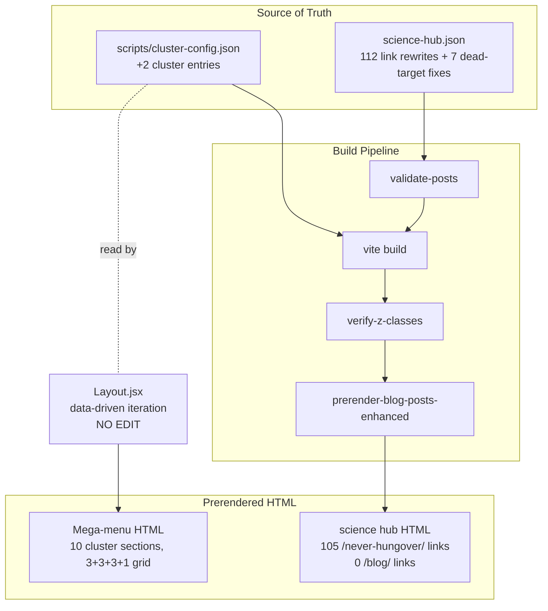

# Design: issue-364-hub-promotion

## Overview

Two file edits ship this PR: append 2 new clusters to `scripts/cluster-config.json` (`dhm-safety` + `hangover-science`) and rewrite all 112 `(/blog/...)` markdown links in `src/newblog/data/posts/complete-hangover-science-hub-2025.json` to `(/never-hungover/...)`. Layout.jsx auto-renders new clusters via existing data-driven iteration (zero JSX edits). 7 dead-link targets handled per the decision table below — 4 replaced with topic-adjacent slugs, 3 deleted (line removed) where no nearest-match exists. Total impact: 2 production file edits + 1 spec scaffold commit = 3 commits, 3 files of production diff.

## Architecture



## Decisions Resolved

### D1: Per-link decisions for the 7 dead `/blog/` targets

Verified via `comm -23 <unique-targets> <available-slugs>`:

| Dead target | Decision | Replacement / Notes |
|---|---|---|
| `complete-guide-hangover-types-2025` | DELETE line | `.bak` file confirms post was removed; no nearest-match. Drop the bullet entirely. |
| `whiskey-vs-vodka-hangover` | DELETE line | Two separate posts exist (`whiskey-hangover-why-it-happens-prevention-guide`, `vodka-hangover-why-it-happens-prevention-guide`) but neither is a comparison; safer to drop the bullet than fabricate a comparison link. |
| `hangxiety-2025-dhm-prevents-post-drinking-anxiety` | REPLACE | → `hangxiety-complete-guide-2026-supplements-research` (existing canonical hangxiety pillar; same topic). |
| `post-dry-january-smart-drinking-strategies-2025` | DELETE line | No "smart drinking strategies" or "dry january" replacement exists in registry. Drop the bullet. |
| `flyby-vs-fuller-health-complete-comparison-2025` | REPLACE | → `flyby-vs-fuller-health-complete-comparison` (same slug minus the `-2025` suffix; verified exists in registry — pure typo fix). |
| `professional-hangover-free-networking-guide-2025` | REPLACE | → `business-dinner-networking-dhm-guide-2025` (closest topic match; "Professional & Business" section already lists this nearby). |
| `rush-week-survival-guide-dhm-strategies-sorority-recruitment-2025` | REPLACE | → `greek-life-success-dhm-2025` (already linked 2 lines above in same "College & Greek Life" section; topic match). |

**Rationale**: Conservative default per requirements EC-1. Replace only when (a) typo/slug rename is obvious (`flyby-vs-fuller-health-complete-comparison-2025` → strip `-2025`) or (b) a topic-adjacent canonical exists in the same hub section. When neither applies, delete the bullet — keeps prose clean, never creates a soft-404 signal.

**Net result**: 105 `/blog/` → `/never-hungover/` rewrites + 4 slug substitutions + 3 line deletions = 112 dead `/blog/` links eliminated.

### D2: Spoke selection for the 2 new clusters

**`dhm-safety` cluster** (pillar: `ultimate-dhm-safety-guide-hub-2025`):

| Spoke slug | Index status | Rationale |
|---|---|---|
| `is-dhm-safe-science-behind-side-effects-2025` | CNI (borderline) | Core safety post; cluster signal may help recovery |
| `dhm-medication-interactions-safety-guide-2025` | DCNI | Topically essential; cluster authority signal worth the risk |
| `dhm-women-hormonal-considerations-safety-2025` | CNI | Already a spoke in `hangxiety-mental-health` (multi-cluster tolerated per research §4) |
| `dhm-adults-over-50-age-related-safety-2025` | DCNI | Topically essential per pillar narrative |
| `can-you-take-dhm-every-day-long-term-guide-2025` | INDEXED | Strong indexed spoke anchors the cluster |
| `dhm-dosage-guide-2025` | INDEXED | Strong indexed spoke; foundational dosage reference |

6 spokes; first 5 surface in mega-menu (display cap). Order matters: indexed-first pulls strongest signals into menu visibility.

**`hangover-science` cluster** (pillar: `complete-hangover-science-hub-2025`):

| Spoke slug | Index status | Rationale |
|---|---|---|
| `dhm-randomized-controlled-trials` | INDEXED | Strongest indexed science post |
| `dhm-japanese-raisin-tree-complete-guide` | INDEXED | Foundational science; existing strong link |
| `how-to-cure-a-hangover-complete-science-guide` | CNI | Already linked at hub top; flagship science content |
| `how-long-does-hangover-last` | CNI | Hub's #2 link; high topical relevance |
| `dhm-science-explained` | CNI | Hub's primary mechanism explainer |

5 spokes; all 5 surface in mega-menu. Indexed-first ordering. Note: `does-dhm-work-honest-science-review-2025` (DCNI) excluded — keeps one DCNI URL out of cluster to avoid signal dilution.

**Verification**: All 11 spoke slugs confirmed via `grep -E "<slug>" src/newblog/data/postRegistry.js`.

### D3: clusterLabel() function check

Read `src/components/layout/Layout.jsx:13–24`:

```js
const ACRONYMS = new Set(['dhm', 'nac', 'bac', 'rem', 'gi'])
function clusterLabel(name) {
  if (name === 'dhm-master') return 'DHM Master'
  if (name === 'health-impact') return 'Alcohol & Health'
  return titleCase(name.split('-'))  // auto-titlecase fallback
}
```

**No code changes needed.** Auto-titlecase covers both new clusters:
- `dhm-safety` → `["dhm","safety"]` → ACRONYMS hits → **"DHM Safety"** ✓
- `hangover-science` → `["hangover","science"]` → **"Hangover Science"** ✓

Hardcoded special-cases exist only for `dhm-master` (would otherwise read "DHM Master" — same; redundant) and `health-impact` (would otherwise read "Health Impact" — different). Our 2 new IDs auto-titlecase exactly as desired. **Zero Layout.jsx edits in this PR.**

## File-by-File Plan

### 1. `scripts/cluster-config.json` — append 2 clusters

Insert after the existing `hangxiety-mental-health` cluster (final entry, line 186), before the closing `]`:

```jsonc
    {
      "name": "dhm-safety",
      "pillar": "ultimate-dhm-safety-guide-hub-2025",
      "spokes": [
        "can-you-take-dhm-every-day-long-term-guide-2025",
        "dhm-dosage-guide-2025",
        "is-dhm-safe-science-behind-side-effects-2025",
        "dhm-medication-interactions-safety-guide-2025",
        "dhm-women-hormonal-considerations-safety-2025",
        "dhm-adults-over-50-age-related-safety-2025"
      ],
      "keywords": [
        "dhm safety",
        "side effects",
        "drug interactions",
        "long-term use",
        "safety profile"
      ],
      "anchor_phrases": [
        "ultimate DHM safety guide",
        "complete DHM safety reference",
        "evidence-based DHM safety analysis"
      ]
    },
    {
      "name": "hangover-science",
      "pillar": "complete-hangover-science-hub-2025",
      "spokes": [
        "dhm-randomized-controlled-trials",
        "dhm-japanese-raisin-tree-complete-guide",
        "how-to-cure-a-hangover-complete-science-guide",
        "how-long-does-hangover-last",
        "dhm-science-explained"
      ],
      "keywords": [
        "hangover science",
        "hangover mechanisms",
        "alcohol metabolism",
        "hangover research",
        "DHM clinical research"
      ],
      "anchor_phrases": [
        "complete hangover science hub",
        "comprehensive hangover research guide",
        "evidence-based hangover science"
      ]
    }
```

Schema matches existing 8 clusters exactly (`name`, `pillar`, `spokes`, `keywords`, `anchor_phrases` — same key set, same indentation).

### 2. `src/newblog/data/posts/complete-hangover-science-hub-2025.json` — link rewrite + dead-target fixes

**Step A: 105 bulk rewrites** — apply regex `(/blog/` → `(/never-hungover/` ONLY to lines that don't contain a dead target. The schema `mainEntityOfPage @id` URL is NOT matched (no `(` prefix; verified research §5).

**Step B: 4 slug substitutions** (replace specific dead targets with valid replacements before rewriting):

| Before | After |
|---|---|
| `(/blog/hangxiety-2025-dhm-prevents-post-drinking-anxiety)` | `(/never-hungover/hangxiety-complete-guide-2026-supplements-research)` |
| `(/blog/flyby-vs-fuller-health-complete-comparison-2025)` | `(/never-hungover/flyby-vs-fuller-health-complete-comparison)` |
| `(/blog/professional-hangover-free-networking-guide-2025)` | `(/never-hungover/business-dinner-networking-dhm-guide-2025)` |
| `(/blog/rush-week-survival-guide-dhm-strategies-sorority-recruitment-2025)` | `(/never-hungover/greek-life-success-dhm-2025)` |

**Step C: 3 line deletions** (drop entire markdown bullet line — keeps surrounding section intact):

| Section | Line to delete |
|---|---|
| `## Understanding Hangovers: The Science` → `### Core Hangover Science` | `- [**Complete Guide to Hangover Types**](/blog/complete-guide-hangover-types-2025) - Different types of hangovers and their unique characteristics\n` |
| `## Alcohol Types & Their Effects` → `### Spirits` | `- [**Whiskey vs Vodka Hangover**](/blog/whiskey-vs-vodka-hangover) - Comparing congener content and hangover severity\n` |
| `## Special Topics & Trends` → `### Fitness & Health` | `- [**Post Dry January Smart Drinking Strategies**](/blog/post-dry-january-smart-drinking-strategies-2025) - Transitioning back to social drinking\n` |

Each deletion removes a single bullet line (with leading `\n`) from the JSON `content` field. Section headers and surrounding bullets remain untouched.

**Sample diffs**:

```diff
- [**How to Cure a Hangover: Complete Science Guide**](/blog/how-to-cure-a-hangover-complete-science-guide)
+ [**How to Cure a Hangover: Complete Science Guide**](/never-hungover/how-to-cure-a-hangover-complete-science-guide)

- [**Hangxiety 2025: DHM Prevents Post-Drinking Anxiety**](/blog/hangxiety-2025-dhm-prevents-post-drinking-anxiety) - Complete guide to hangover anxiety
+ [**Hangxiety 2025: DHM Prevents Post-Drinking Anxiety**](/never-hungover/hangxiety-complete-guide-2026-supplements-research) - Complete guide to hangover anxiety
```

For deletions:
```diff
- [**How Long Does a Hangover Last?**](/blog/how-long-does-hangover-last) - Timeline and factors affecting hangover duration
- [**Complete Guide to Hangover Types**](/blog/complete-guide-hangover-types-2025) - Different types of hangovers and their unique characteristics
- [**Hangover Career Impact & DHM Solution**](/blog/hangover-career-impact-dhm-solution-2025) - How hangovers affect professional performance
+ [**How Long Does a Hangover Last?**](/never-hungover/how-long-does-hangover-last) - Timeline and factors affecting hangover duration
+ [**Hangover Career Impact & DHM Solution**](/never-hungover/hangover-career-impact-dhm-solution-2025) - How hangovers affect professional performance
```

**Implementation order** (in tasks.md):
1. Step B substitutions FIRST (replaces specific dead-target paths in-place; some need slug change AND prefix change)
2. Step C deletions (removes 3 bullet lines)
3. Step A bulk regex `(/blog/` → `(/never-hungover/` LAST (catches all remaining 105 valid links)

This order ensures Step A's bulk regex doesn't first rewrite a dead target to `/never-hungover/<dead-slug>` which would then need a second substitution.

## Verification Commands

```bash
# AC-1.1 / FR-1+FR-2: 10 clusters, both new clusters present
node -e "const c=require('./scripts/cluster-config.json').clusters; console.log('count:',c.length); console.log('new:',c.filter(x=>x.name==='dhm-safety'||x.name==='hangover-science').map(x=>x.pillar))"
# Expect: count: 10
# Expect: new: ['ultimate-dhm-safety-guide-hub-2025', 'complete-hangover-science-hub-2025']

# AC-1.2: hubs in dist mega-menu (pre-rendered HTML)
npm run build
grep -c 'ultimate-dhm-safety-guide-hub-2025' dist/index.html  # expect ≥2 (desktop + mobile menu)
grep -c 'complete-hangover-science-hub-2025' dist/index.html  # expect ≥2

# AC-2.1 / FR-5: zero /blog/ markdown links remain
grep -oE '\(/blog/' src/newblog/data/posts/complete-hangover-science-hub-2025.json | wc -l
# Expect: 0

# AC-2.2: substitution count check
grep -c '/never-hungover/' src/newblog/data/posts/complete-hangover-science-hub-2025.json
# Expect: ≥109 (105 rewrites + 4 substitutions; subtract 3 deleted lines from 112)

# AC-2.3 / FR-6: every link target exists
node -e "const fs=require('fs'); const reg=fs.readFileSync('src/newblog/data/postRegistry.js','utf8'); const hub=fs.readFileSync('src/newblog/data/posts/complete-hangover-science-hub-2025.json','utf8'); const links=[...hub.matchAll(/\(\/never-hungover\/([a-z0-9-]+)\)/g)].map(m=>m[1]); const missing=links.filter(s=>!reg.includes(\`\"\${s}\"\`)); console.log('missing:', missing.length, missing)"
# Expect: missing: 0 []

# AC-3.1 / FR-7: build green
npm run build && echo "BUILD OK"

# AC-3.1 / NFR-3: broken-link audit clean
node scripts/check-broken-internal-links.mjs
# Expect: 0 broken refs

# FR-8: hub HTML schema unchanged (still Article)
grep -oE '"@type":"Article"' dist/never-hungover/complete-hangover-science-hub-2025/index.html | head -1
grep -oE '"@type":"Article"' dist/never-hungover/ultimate-dhm-safety-guide-hub-2025/index.html | head -1
# Expect: each prints "@type":"Article" once
```

## Risk Register

| Risk | Severity | Mitigation |
|---|---|---|
| Spoke chosen for cluster doesn't actually exist in postRegistry | **Low** | All 11 spoke slugs verified via grep against `src/newblog/data/postRegistry.js` (D2 verification step). |
| `clusterLabel()` mapping missing for new IDs | **None** | Read Layout.jsx:13–24 — auto-titlecase fallback covers both `dhm-safety` and `hangover-science` correctly via the ACRONYMS set. No edit needed. |
| Wrong-topic replacement for dead target → soft 404 signal to Google | **Low** | 4 replacements documented with topic rationale; 3 conservative deletions where no nearest-match. Each replacement is either a typo fix (slug rename) or a same-section topical sibling. |
| Mega-menu visual goes from 3 to 4 rows (3+3+3+1 grid layout) | **Low** | Accepted in requirements (EC-3). Out-of-scope to widen to `grid-cols-4`. |
| Regex bulk rewrite hits the schema `mainEntityOfPage @id` URL | **None** | Regex anchored to `(` prefix; schema URL is `"@id":"https://..."` (no paren). Verified research §5. |
| Step ordering wrong — bulk rewrite runs first, masks dead targets | **Low** | tasks.md will enforce order: substitutions → deletions → bulk rewrite. Verification step (`grep -oE '\(/blog/'` returns 0) catches order violations. |
| `cluster-formalize.mjs --apply` accidentally re-runs and mutates content | **Low** | Out-of-scope; not run in this PR. Documented in requirements. |
| Spoke slug collision with existing cluster (e.g., `dhm-women-hormonal...` in 2 clusters) | **None** | Already common pattern; `cluster-formalize.mjs` 5-cap merge logic handles it. Verified research §4. |

## PR Strategy

3 logical commits, each with `Co-Authored-By: Claude Opus 4.7 (1M context) <noreply@anthropic.com>` trailer:

1. **`feat(cluster-config): add dhm-safety and hangover-science clusters (#364)`**
   - Stage: `scripts/cluster-config.json` only
   - Effect: Mega-menu auto-renders 10 clusters; both hubs gain sitewide nav inbound.

2. **`fix(content): rewrite 112 /blog/ links to /never-hungover/ in science hub (#364)`**
   - Stage: `src/newblog/data/posts/complete-hangover-science-hub-2025.json` only
   - Effect: 0 redirect-chain links in hub; 7 dead-target lines handled (4 replaced, 3 deleted).

3. **`chore(spec): scaffold ralph spec artifacts for issue #364`**
   - Stage: `specs/issue-364-hub-promotion/{progress,research,requirements,design,tasks}.md` (+ `.ralph-state.json` if tracked)
   - Effect: Documentation artifact only; no code/content impact.

Branch: `cleanup/issue-364-hub-promotion` (per `.progress.md`). Single PR.

## Implementation Steps

1. Append 2 cluster blocks to `scripts/cluster-config.json` (after `hangxiety-mental-health`, preserving 2-space indent and trailing-comma style of existing entries).
2. Validate JSON syntax: `node -e "JSON.parse(require('fs').readFileSync('scripts/cluster-config.json','utf8'))"` (must exit 0).
3. Open `src/newblog/data/posts/complete-hangover-science-hub-2025.json`. In the `content` field:
   a. Apply 4 explicit substitutions (Step B from File-by-File Plan).
   b. Delete 3 specific bullet lines (Step C).
   c. Apply bulk regex `(/blog/` → `(/never-hungover/` to remaining content (Step A).
4. Run `node -e "JSON.parse(require('fs').readFileSync('src/newblog/data/posts/complete-hangover-science-hub-2025.json','utf8'))"` to confirm JSON still parses.
5. Run `grep -oE '\(/blog/' src/newblog/data/posts/complete-hangover-science-hub-2025.json | wc -l` — must return 0.
6. Run `node scripts/check-broken-internal-links.mjs` — must report 0 broken refs.
7. Run `npm run build` — must exit 0; `dist/never-hungover/{both-hub-slugs}/index.html` must exist.
8. Verify mega-menu HTML: `grep -c 'ultimate-dhm-safety-guide-hub-2025' dist/index.html` ≥ 2.
9. Commit (3 commits per PR Strategy section).
10. Push to `cleanup/issue-364-hub-promotion`; open PR per CLAUDE.md gh workflow.
