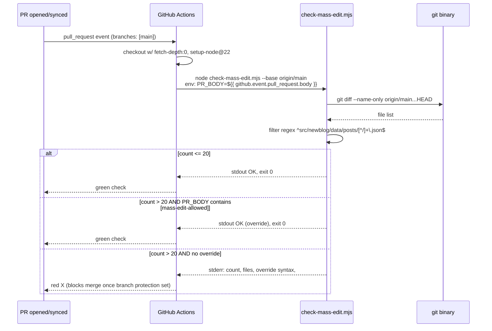

# Design: issue-366-moratorium

## 1. Overview

Single ESM script (~80 LOC) + 1 workflow job addition + ~10 lines added to CLAUDE.md + 4 spec artifacts. Mirror the `verify-z-classes.mjs` precedent: Node stdlib only, zero deps, binary exit code, multi-line failure message linking to root cause. Total file impact: 4-5 files; **zero post JSONs modified** (self-passes its own check).

## Architecture

```mermaid
graph TB
    subgraph CI["GitHub Actions: lockfile-check.yml"]
        Trigger[pull_request to main] --> Job1[pnpm-frozen-lockfile]
        Trigger --> Job2[build]
        Trigger --> Job3[mass-edit-check NEW]
        Job3 --> Checkout[checkout fetch-depth:0]
        Checkout --> Script[node scripts/check-mass-edit.mjs]
        Script --> Diff[git diff --name-only base...HEAD]
        Diff --> Filter[regex: src/newblog/data/posts/*.json]
        Filter --> Decision{count > 20?}
        Decision -->|no| Pass[exit 0]
        Decision -->|yes, has tag| Pass
        Decision -->|yes, no tag| Fail[exit 1: stderr w/ link to #366]
    end
    PRBody[PR description ${{ github.event.pull_request.body }}] -.PR_BODY env.-> Script
```

## 2. Module Shape — `scripts/check-mass-edit.mjs`

**Code skeleton** (final implementation will mirror this exactly):

```js
#!/usr/bin/env node
/**
 * check-mass-edit.mjs
 *
 * CI guardrail for the mass-edit moratorium (issue #366, expires 2026-07-15).
 * Fails if a PR modifies > THRESHOLD post JSONs without [mass-edit-allowed]
 * in the PR description.
 *
 * Mirrors scripts/verify-z-classes.mjs precedent: Node stdlib only, zero deps,
 * binary exit code, multi-line failure message linking to root cause.
 *
 * Usage:
 *   node scripts/check-mass-edit.mjs                                  # default base=origin/main, threshold=20
 *   node scripts/check-mass-edit.mjs --base HEAD~5                    # local testing
 *   node scripts/check-mass-edit.mjs --pr-body "..." --threshold 10   # CLI override
 *
 * Refs: https://github.com/kavanaghpatrick/dhm-guide-website/issues/366
 *       CLAUDE.md "Mass-Edit Moratorium Policy" section
 */

import { execSync } from 'node:child_process';

// Argv parsing (stdlib only)
const args = process.argv.slice(2);
const getFlag = (name, def) => {
  const i = args.indexOf(`--${name}`);
  return i === -1 ? def : args[i + 1];
};

const BASE = getFlag('base', 'origin/main');
const THRESHOLD = parseInt(getFlag('threshold', '20'), 10);
const PR_BODY = getFlag('pr-body', process.env.PR_BODY || '');
const OVERRIDE_TAG = '[mass-edit-allowed]';
const POST_RE = /^src\/newblog\/data\/posts\/[^/]+\.json$/;

// Determine modified post JSONs
let changed;
try {
  changed = execSync(`git diff --name-only ${BASE}...HEAD`, { encoding: 'utf8' })
    .split('\n')
    .filter(f => POST_RE.test(f));
} catch (e) {
  console.error(`[check-mass-edit] Failed to compute diff against ${BASE}: ${e.message}`);
  console.error('In CI, ensure actions/checkout uses fetch-depth: 0');
  process.exit(2);
}

const count = changed.length;
const hasOverride = PR_BODY.includes(OVERRIDE_TAG);

if (count <= THRESHOLD) {
  console.log(`[check-mass-edit] OK: ${count} post JSON(s) modified (threshold ${THRESHOLD})`);
  process.exit(0);
}

if (hasOverride) {
  console.log(`[check-mass-edit] OK (override): ${count} files modified, PR body contains ${OVERRIDE_TAG}`);
  process.exit(0);
}

// Failure — clear, actionable error message
console.error(`\n[check-mass-edit] FAIL — mass-edit moratorium violation`);
console.error(`  Modified ${count} post JSONs in src/newblog/data/posts/ (threshold: ${THRESHOLD})`);
console.error(`  This may trigger a Google recrawl wave during DCNI recovery`);
console.error(`  (issue #366, expires 2026-07-15)`);
console.error(``);
console.error(`  Files (first 10):`);
changed.slice(0, 10).forEach(f => console.error(`    ${f}`));
if (count > 10) console.error(`    ... and ${count - 10} more`);
console.error(``);
console.error(`  To override (with rationale), add to PR description:`);
console.error(`    ${OVERRIDE_TAG}`);
console.error(``);
console.error(`  Background: https://github.com/kavanaghpatrick/dhm-guide-website/issues/366`);
console.error(`  Policy: CLAUDE.md "Mass-Edit Moratorium Policy" section\n`);
process.exit(1);
```

**Design notes**:
- ESM (`.mjs`) — matches `scripts/verify-z-classes.mjs`
- Stdlib only: `node:child_process` for `execSync`. No npm deps.
- Three flags (`--base`, `--threshold`, `--pr-body`) for local testing parity with CI.
- Defensive: traps `execSync` error and emits the `fetch-depth: 0` hint.
- Failure message order: WHAT → WHY → FILES → HOW TO OVERRIDE → BACKGROUND.

## 3. Workflow Extension — `.github/workflows/lockfile-check.yml`

**Add new job** AFTER existing `build` job. Same trigger (`pull_request: branches: [main]`), no `pnpm install` needed (Node stdlib only):

```yaml
  mass-edit-check:
    name: Mass-edit moratorium check (#366, expires 2026-07-15)
    runs-on: ubuntu-latest
    timeout-minutes: 2
    if: github.event_name == 'pull_request'
    steps:
      - uses: actions/checkout@v4
        with:
          fetch-depth: 0
      - uses: actions/setup-node@v4
        with:
          node-version: 22
      - name: Check post JSON modification count
        env:
          PR_BODY: ${{ github.event.pull_request.body }}
        run: node scripts/check-mass-edit.mjs --base origin/${{ github.base_ref }}
```

**Design notes**:
- Job name embeds `expires 2026-07-15` — visible on every PR (forcing function for cleanup).
- `fetch-depth: 0` — required for `git diff <base>...HEAD` to resolve.
- `--base origin/${{ github.base_ref }}` — uses actual target branch (defensive; not hardcoded `main`).
- `PR_BODY` passed via env (cleaner than shell-escaping a multi-line PR body into a flag); script falls back to env var when `--pr-body` flag absent.
- No `pnpm install` step — script has zero deps.
- `if: github.event_name == 'pull_request'` — defensive guard (workflow already filters, but explicit > implicit).

## 4. CLAUDE.md Addition

**Insertion point**: AFTER existing `## Spec Artifact Commit Policy` section (CLAUDE.md line 587, the `---` separator), BEFORE `## ⚠️ Red Flags (STOP and Simplify)` (line 591). Mirrors the spec-artifact section formatting precedent.

**Content** (~10 lines):

```markdown
## Mass-Edit Moratorium Policy

**Active until 2026-07-15** (issue #366).

Per the DCNI investigation (#362): mass-edits across many post JSONs trigger Google recrawl waves which re-evaluate posts against the current quality bar. PR #243 (147 files) and #246 (197 files) caused measurable DCNI growth. The moratorium prevents recurrence during recovery.

**The rule**: PRs modifying >20 files in `src/newblog/data/posts/` will FAIL CI.

**Escape hatch**: Add `[mass-edit-allowed]` to PR description with rationale (e.g., "corpus restore from backup", "post-moratorium realignment").

**At 2026-07-15**: remove this section, the workflow job, and `scripts/check-mass-edit.mjs`.

**Tracking**: weekly DCNI count via GSC. See issue #366.
```

## File Structure

| File | Action | Purpose |
|------|--------|---------|
| `scripts/check-mass-edit.mjs` | Create | CI guardrail script (~80 LOC) |
| `.github/workflows/lockfile-check.yml` | Modify | Add `mass-edit-check` job (~14 lines) |
| `CLAUDE.md` | Modify | Insert "Mass-Edit Moratorium Policy" section (~13 lines) |
| `specs/issue-366-moratorium/research.md` | Create | Spec artifact (already exists) |
| `specs/issue-366-moratorium/requirements.md` | Create | Spec artifact (already exists) |
| `specs/issue-366-moratorium/design.md` | Create | This file |
| `specs/issue-366-moratorium/tasks.md` | Create | Generated next phase |

## Data Flow



## Technical Decisions

| Decision | Options Considered | Choice | Rationale |
|----------|--------------------|--------|-----------|
| Module format | `.mjs` ESM, `.cjs`, `.js` w/ `type: module` | `.mjs` | Matches `scripts/verify-z-classes.mjs` precedent (NFR-5) |
| Dependencies | npm package (e.g., `simple-git`), stdlib | stdlib + `git` shellout | Pattern #1 simplicity; zero supply-chain risk |
| Threshold | 10, 20, 30, 50 | 20 | Above largest non-triggering known PR (#84 = 13); below smallest wave-triggering (#243 = 147) |
| Override mechanism | Label, file marker, PR body tag | PR body `[mass-edit-allowed]` | Mirrors `[skip ci]` idiom; greppable; signals intent in diff |
| Workflow placement | New file, extend existing | Extend `lockfile-check.yml` | Per research recommendation; same trigger, simpler ops |
| Diff command | `merge-base + diff`, `diff base...HEAD` (triple-dot) | `diff base...HEAD` | Triple-dot syntax does merge-base internally; one command vs two |
| Job name format | Plain "Mass-edit check", with expiry date | "...(#366, expires 2026-07-15)" | Forcing function: cleanup deadline visible on every PR |
| `--base` value in CI | Hardcode `origin/main`, dynamic | `origin/${{ github.base_ref }}` | Defensive against future PRs targeting other branches |
| PR body delivery | CLI flag, env var | Env var (`PR_BODY`) with `--pr-body` fallback | Avoids shell-escaping multiline PR body; flag preserves local-test parity |
| Renames | Special-case rename detection, count both | Count both | Acceptable false-positive; renames don't cause DCNI but err safe |
| Auto-disable at expiry | Cron, date check in script, manual | Manual | Pattern #1 simplicity; expiry-in-job-name is the forcing function |

## Error Handling

| Error Scenario | Handling Strategy | User Impact |
|----------------|-------------------|-------------|
| `git diff` fails (shallow clone, missing ref) | `try/catch`; emit error w/ `fetch-depth: 0` hint; exit 2 | Contributor sees actionable hint in CI logs |
| `parseInt(threshold)` returns `NaN` | Doc'd as caller error; not handled | Tester error, not user-facing |
| PR_BODY null/undefined (e.g., draft PR with no description) | Default `''` via `process.env.PR_BODY || ''` | No override; threshold check runs normally |
| Empty diff (zero changes) | Filtered list is empty; count = 0; exit 0 | Fast happy path with `OK: 0 post JSON(s) modified` |
| Renamed posts | Both old and new path counted | Slight false-positive risk; documented edge case |
| `--base` ref doesn't exist | `execSync` throws → exit 2 with hint | Local-dev only; CI guarantees `origin/main` |

## Edge Cases

- **PR retargeted from main → develop**: `--base origin/${{ github.base_ref }}` adapts automatically.
- **Force-push that mass-deletes posts**: Deletions count toward threshold (intentional — also a sitemap signal change).
- **Branch behind main**: Triple-dot `base...HEAD` resolves merge-base correctly; only divergent files counted.
- **Empty PR body**: No override; threshold check applies. Conservative default.
- **Branch protection not yet enabled (manual GitHub UI step)**: Job still runs, still reports red/green; merge isn't blocked until admin sets branch protection (AC-2.5, Medium priority).
- **Self-test on this PR**: 0 post JSONs modified → exit 0 trivially.

## Test Strategy

### Manual Verification (per AC, Pattern #1 — no test framework)

```bash
# AC-1.1: script exists and is executable
test -f scripts/check-mass-edit.mjs && echo "PASS"

# AC-2.1: workflow has new job with expiry date
grep -q "Mass-edit moratorium check (#366, expires 2026-07-15)" .github/workflows/lockfile-check.yml && echo "PASS"

# AC-3.1: CLAUDE.md has new section
grep -q "## Mass-Edit Moratorium Policy" CLAUDE.md && echo "PASS"

# AC-4.2: self-test on this PR (zero post JSONs modified — should pass)
node scripts/check-mass-edit.mjs --pr-body "" --base origin/main && echo "PASS self-test"

# AC-4.3: threshold + override path (synthetic test)
node scripts/check-mass-edit.mjs --pr-body "" --threshold 0 --base HEAD~1 ; echo "exit=$?"
# Expected: exit 1 if any post JSON in last commit, exit 0 otherwise.
node scripts/check-mass-edit.mjs --pr-body "[mass-edit-allowed]" --threshold 0 --base HEAD~1 ; echo "exit=$?"
# Expected: exit 0 (override accepted)

# AC-4.1: full build green
npm run build && echo "PASS build"
```

No unit tests. Per Pattern #1 (simplicity) and research recommendation #6 ("simple shell-out, manual verification on the PR itself is the test").

## Performance Considerations

- Script wall time: <2s (one `git diff` + regex filter on small list).
- CI job timeout: 2 minutes (NFR-6) — generous safety margin.
- No `pnpm install` step in this job → faster than the `build` job (~30s vs minutes).

## Security Considerations

- **No secrets handled.** Script reads only `git diff` output and PR body string.
- **PR body contains untrusted user input** but is only checked via `String.prototype.includes()` — no eval, no shell interpolation, no injection surface.
- **`execSync` arg**: only the `--base` value is interpolated. In CI, `${{ github.base_ref }}` is a GitHub-controlled branch name (alphanumeric + `-`, `_`, `/`); not arbitrary user input. Local CLI use trusts the operator.
- No npm deps → zero supply-chain attack surface added.

## Existing Patterns to Follow

Per research:
- `scripts/verify-z-classes.mjs` (Pattern #15): Node stdlib only, multi-line `console.error` with cause + remedy + ref link, binary exit code.
- `.github/workflows/lockfile-check.yml`: existing two-job workflow extended (not forked), `actions/checkout@v4` + `actions/setup-node@v4` standard, `pull_request: branches: [main]` trigger.
- CLAUDE.md "Spec Artifact Commit Policy" (line 575): formatting precedent for adjacent "Mass-Edit Moratorium Policy" section.

## 5. Verification Commands (Summary)

| AC | Command | Expected |
|----|---------|----------|
| AC-1.1 | `test -f scripts/check-mass-edit.mjs && echo PASS` | PASS |
| AC-2.1 | `grep -q "Mass-edit moratorium check" .github/workflows/lockfile-check.yml && echo PASS` | PASS |
| AC-3.1 | `grep -q "## Mass-Edit Moratorium Policy" CLAUDE.md && echo PASS` | PASS |
| AC-4.1 | `npm run build && echo PASS` | PASS (build green) |
| AC-4.2 | `node scripts/check-mass-edit.mjs --pr-body "" --base origin/main && echo PASS` | PASS (zero post JSONs in this PR) |
| AC-4.3 | `node scripts/check-mass-edit.mjs --pr-body "[mass-edit-allowed]" --threshold 0 --base HEAD~1 ; echo exit=$?` | exit=0 (override accepted) |

**6 verification commands.** No external dependencies, all runnable locally + in CI.

## 6. Risk Register

| Risk | Severity | Mitigation |
|------|----------|------------|
| Forgotten cleanup at 2026-07-15 | **Med (largest)** | Expiry date in workflow job name (visible on every PR) + CLAUDE.md "At 2026-07-15: remove..." instruction |
| Local dev test breaks (no `origin/main` ref) | Low | Clear `try/catch` error message includes `fetch-depth: 0` hint and exit 2 |
| Renamed posts counted as mass-edit | Low | Documented edge case; acceptable false-positive (renames don't trigger DCNI) |
| `git diff` returns nothing in CI (shallow checkout) | High | `fetch-depth: 0` in workflow checkout (AC-2.3) |
| Future contributor adds 21-file PR | Expected | Either splits PR or adds escape hatch — both acceptable per US-2 |
| Bypass tag abused (every PR adds it) | Low | Tag is opt-in; rationale in PR body adjacent, reviewable in diff |
| PR description not in CI context | Low | `${{ github.event.pull_request.body }}` is GitHub-native; works on first push to PR |

## 7. PR Strategy — 4 Commits with `Co-Authored-By` Trailer

Each commit ends with:
```
Co-Authored-By: Claude Opus 4.7 (1M context) <noreply@anthropic.com>
```

| # | Commit Message | Files Staged |
|---|----------------|--------------|
| 1 | `feat(scripts): add mass-edit moratorium CI guardrail script (#366)` | `scripts/check-mass-edit.mjs` only |
| 2 | `ci: add mass-edit moratorium check job to lockfile workflow (#366)` | `.github/workflows/lockfile-check.yml` only |
| 3 | `docs(claude): document mass-edit moratorium policy (#366)` | `CLAUDE.md` only |
| 4 | `chore(spec): scaffold ralph spec artifacts for issue #366` | `specs/issue-366-moratorium/{research,requirements,design,tasks}.md` |

**Sequence rationale**: script first (the artifact being referenced), workflow second (depends on script existing in tree), docs third (depends on script + workflow as referent), spec artifacts last (meta — describes the work itself). This order keeps each commit independently revertible without breaking earlier ones.

## Unresolved Questions

None blocking. All design choices defensible from existing precedent (`verify-z-classes.mjs`, `lockfile-check.yml`, CLAUDE.md spec-artifact section).

## Implementation Steps

1. Create `scripts/check-mass-edit.mjs` with the skeleton in §2 (verify exit codes via local synthetic tests).
2. Verify locally: `node scripts/check-mass-edit.mjs --pr-body "" --base origin/main` exits 0 on this branch.
3. Verify override: `node scripts/check-mass-edit.mjs --pr-body "[mass-edit-allowed]" --threshold 0 --base HEAD~3` exits 0.
4. Edit `.github/workflows/lockfile-check.yml` — append `mass-edit-check` job per §3.
5. Edit `CLAUDE.md` — insert "Mass-Edit Moratorium Policy" section per §4 between line 587 (`---`) and line 589 (`---` before Red Flags).
6. Run `npm run build` — verify green.
7. Stage and commit per the 4-commit plan in §7.
8. Push branch; verify the CI job runs against itself and passes (self-test).
9. After merge: manually enable branch protection requiring the `Mass-edit moratorium check` status (AC-2.5).
